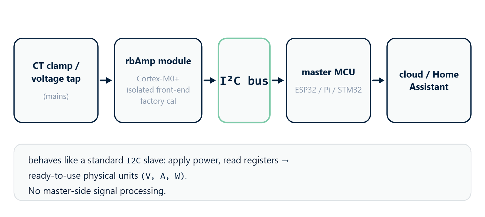

# 01 · Overview



## What rbAmp is

**rbAmp** is a compact hardware module for precision measurement of
AC-mains parameters over the I²C interface. It is built on a
Cortex-M0+ microcontroller with an integrated isolated analog
front-end and factory calibration stored in flash.

From an integrator's point of view the module behaves as a standard
I²C slave: connect power, read the registers, and you get ready-made
values in physical units. No signal processing on the master side is
required.

## The library's main purpose — monitoring multiple loads

The `RbAmp` Arduino library is built **to work with a group of
modules simultaneously** on a single I²C bus, not to drive a single
device. The canonical scenario is **one main module on the mains feed
plus N modules on individual loads**, all on one bus, driven by a
single Arduino/ESP32. The library provides the **`RbAmpFleet`** class —
a single object through which you scan the bus, poll every module with
one call, obtain total consumed power and the "feed − Σ(loads)"
balance, catch errors on each module, and, when needed, synchronize
period snapshots with a broadcast command.

**Multi-channel** modules are also supported (`I2`, `I3` — two or
three CTs on one module, each with its own sensor model). This is
typical for a sub-panel, where a single installation point monitors
several feeders.

Working with a **single** module is the minimal case of this same
library: the `RbAmp` class is the building block on top of which
`RbAmpFleet` is layered. If you have one module on the bus, you use
that same handle directly — the fleet API is not needed.

## The 80% scenario — mains + N sub-loads

```text
                            ┌──────────────────────────┐
                            │   ESP32/Arduino (master) │
                            │   RbAmpFleet fleet(Wire) │
                            └──┬─────────┬─────────┬───┘
                               │   I²C (shared bus)
        ┌──────────────────────┘         │         │
        │                                │         │
   ┌────▼─────┐                    ┌─────▼─────┐   │
   │ rbAmp #1 │                    │ rbAmp #2  │   │
   │ MAINS    │                    │ Boiler    │   │
   │ 0x50     │                    │ 0x51      │   │
   └──────────┘                    └───────────┘   │
        │ (on the feed)            (load 1)        │
                                                   │
                                             ┌─────▼─────┐
                                             │ rbAmp #3  │
                                             │ A/C       │
                                             │ 0x52      │
                                             └───────────┘
                                            (load 2)
```

- 1 module on the mains feed — overall consumption and grid quality.
- N modules on individual loads — per-channel metering.
- A single `fleet.pollAll()` call polls everything; the
  `mains − Σ(sub_loads)` balance reveals "the rest" (background
  consumption, unmetered loads, leakage).
- One shared master timestamp → correct Wh metering without
  inter-module drift (see [02_tiers.md](02_tiers.md) and the section on
  master wall-clock in [09_api_reference.md](09_api_reference.md)).

> **Important architectural detail.** The I-variants (`I1`/`I2`/`I3`)
> measure **current only** — they have no voltage, no active power,
> and no PF. Active energy (Wh) and power are computed **only on
> UI-variants** (which have a voltage front-end). In the canonical
> deployment the "mains-meter" role (billing energy) is played by a
> single **UI1** on the mains feed; the sub-meter role (per-load
> current detail) is played by **I2**/**I3** modules.

For details, see chapter **06 · Examples**, scenario 1
("Mains + N sub-loads — the 80% canon"). For the API, see chapter
**09 · API Reference**, the "Fleet manager" section.

## What rbAmp measures

| Quantity | Type | Range |
|---|---|---|
| RMS voltage U_rms | float32, V | 0…300 V |
| Peak voltage U_peak | float32, V | 0…450 V |
| RMS current I_rms | float32, A | depends on the selected sensor — see [03_sensor_selection.md](03_sensor_selection.md) |
| Peak current I_peak | float32, A | depends on the selected sensor |
| Active power P (signed in RT) | float32, W | depends on the selected sensor |
| Power factor PF | float32 | −1…+1 |
| Grid frequency | uint8, Hz | 45…65 Hz |
| Period-averaged P | float32, W | as for P |

> **The RT value of active power `P` is always signed on any module
> tier** (negative means export to the grid). The behavior of the
> period-averaged value (`PERIOD_AVG_P_W`) **depends on the module
> tier** — see the "Module tiers" section below and
> [02_tiers.md](02_tiers.md).

## Connection

The module connects to the master with four wires on the LV side. The
mains side is already routed inside the enclosure and is galvanically
isolated.

| Wire | Purpose |
|---|---|
| `VCC` | **+5 V (4.5..5.5 V)**, current ~15 mA, peak ~25 mA. On-board regulator and filtering |
| `GND` | common with the master (**mandatory**) |
| `SDA`, `SCL` | I²C, **3.3 V logic, 5 V-tolerant**. Built-in 4.7 kΩ pull-ups to 3.3 V |
| `DRDY` | optional, open-drain LOW for ~10 µs every ~200 ms |

The default address is `0x50` (7-bit, change range `0x08..0x77`), at
100 kHz (Standard) or 400 kHz (Fast). Cold start until the first valid
measurement is ~250 ms.

The full rules (bus length, pull-up recommendations on a multi-module
bus, wiring schemes with different hosts) are in chapter
[04 · Connection](04_hardware.md).

## Module tiers (quick cheat sheet)

The current rbAmp firmware implements only the **BASIC** tier —
one-way (consumption-only) metering following the logic of a classic
mechanical meter:

| Tier | RT power `P` | Per-period accumulator `PERIOD_AVG_P_W` | Library Wh counter |
|---|---|---|---|
| **BASIC** | signed (negative = export to the grid, visible in real time) | every **200 ms window** of average P is clamped to `max(P, 0)` before being added to the period accumulator | **monotonic** — meters consumption only |
| **STANDARD** | *planned* | *planned* — separate export accumulator | *planned* — bidirectional metering |
| **PRO** | *planned* | *planned* + diagnostics | *planned* + additional counters |

Details are in chapter [02 · Module tiers](02_tiers.md). At the library
level the same `RbAmp` class is used regardless of tier; the
differences show up in the values the module returns.

> **Bidirectional metering on BASIC**: the library's
> `dev.energy().wh(ch)` on the BASIC tier gives consumption only. If
> you need to account for export separately, sample the RT power
> `dev.readPower(0)` at ~5 Hz and split the positive and negative
> samples into two accumulator variables yourself. An example is in
> [06_examples.md](06_examples.md) (the BidirectionalEnergy scenario).

## What this library does

The main job is to hide the protocol exchange and relieve the user
sketch of the routine of working with registers, byte order, and
the settling times after commands. In addition, the library
**computes energy (Wh)** — the module returns only the period-averaged
power, and integration is done by the master against its own clock.

> Building for ESPHome? Use the [external component](https://github.com/rb-amp/rbamp-esphome) instead of this library directly — it integrates the rbAmp protocol natively into the ESPHome YAML pipeline.

### Without the library (direct register access)

```cpp
// Reading U_RMS — in four transactions.
Wire.beginTransmission(0x50);
Wire.write(0x86);
Wire.endTransmission(false);
Wire.requestFrom((uint8_t)0x50, (uint8_t)1);
uint8_t b0 = Wire.read();
// ...repeat for b1, b2, b3...
float u_rms;
uint8_t buf[4] = {b0, b1, b2, b3};
memcpy(&u_rms, buf, 4);
```

### With the library

```cpp
float u_rms = dev.readVoltage();
```

### Reading the period — without the library

```cpp
Wire.beginTransmission(0x50);
Wire.write(0x01); Wire.write(0x27);   // CMD_LATCH_PERIOD
Wire.endTransmission();
uint32_t t_latch_ms = millis();
delay(50);                            // settling time after the command

Wire.beginTransmission(0x50);
Wire.write(0x07);
Wire.endTransmission(false);
Wire.requestFrom((uint8_t)0x50, (uint8_t)1);
if ((Wire.read() & 0x01) == 0) {
    // snapshot is stale — t_latch_ms must STILL be recorded,
    // otherwise the next snapshot will count Wh over two periods
    t_prev_latch_ms = t_latch_ms;   // <-- this line is easy to forget
    return;
}
// ...read 4 bytes of avg_p, assemble the float, integrate Wh:
//   float dt_s = (millis() - t_prev_latch_ms) / 1000.0f;
//   E_Wh += avg_p × dt_s / 3600.0f;
```

### Reading the period — with the library

```cpp
RbAmpPeriodSnapshot snap;
if (dev.readPeriodSnapshot(snap)) {
    // snap.avg_p[0] is filled,
    // dev.energy().wh(0) was incremented by avg_p × master_dt_s / 3600,
    // master_dt_ms is accounted for and saved for the next cycle.
}
```

Internally the library guarantees:

- A 50 ms settling time after `CMD_LATCH_PERIOD`, and a correct read
  of the snapshot (atomic latch on the module side).
- A check of the `PERIOD_VALID` flag before reading.
- Recording the time against the master's clock even on a stale
  snapshot (protects against double-counting Wh on the next period).
- Per-channel Wh accumulation at double precision.
- Automatic loading of calibration coefficients when a current sensor
  is selected via `setSensorClass(class)` + `setCTModel(code)` — the
  user need not know about the NF/GAIN registers.

## When to use the library, when to use direct register access

| Task | Library | Direct register access |
|---|---|---|
| Reading U / I / P / PF / frequency | ✅ | only for debugging on a logic analyzer |
| Per-period energy metering | ✅ | only if Wh are stored outside the library (e.g., in a database on the master side) |
| Several modules on one bus | ✅ | — |
| Bidirectional metering on BASIC | ✅ (via RT sampling — see [06_examples.md](06_examples.md)) | alternative — your own loop of RT reads + manual integration |
| Porting to a non-Arduino platform | n/a | ✅ — see [09 · API Reference](09_api_reference.md), the "Wire-protocol details" section |
| Hard RAM limit (AVR Uno) | ~42 B per `RbAmp` instance + 63 B per snapshot; feasible, but tight on multi-module (3 modules × ~42 B + 3 × 63 B ≈ 315 B already takes a noticeable share of the application's RAM budget) | ✅ if the library instance does not fit |

For all the typical tasks in the first rows the library is the right fit.

## Architecture

```text
┌─────────────────────────────────────────────────────┐
│  User sketch (.ino)                                 │
│   RbAmp dev(Wire, 0x50);                            │
│   dev.begin();                                      │
│   dev.setSensorClass(RbAmpSensorClass::Sct013);     │
│   dev.setCTModel(RbAmpCTModel::Sct013_030);         │
│   dev.readPeriodSnapshot(snap);                     │
│   dev.energy().wh(0);                               │
└─────────────────────────────────────────────────────┘
                       │
                       ▼
┌─────────────────────────────────────────────────────┐
│  Public API of the RbAmp class (RbAmp.h)            │
│   ┌─────────────────────────────────────────────┐   │
│   │ Lifecycle:      begin / probe / waitReady   │   │
│   │ RT reads:       readVoltage / readPower / … │   │
│   │ Period:         latchPeriod /               │   │
│   │                 readPeriodSnapshot          │   │
│   │ Configuration:  setSensorClass / setCTModel │   │
│   │ Diagnostics:    lastError / errorString /   │   │
│   │                 retryExhaustionCount        │   │
│   └─────────────────────────────────────────────┘   │
│                       │                             │
│                       ▼                             │
│   ┌─────────────────────────────────────────────┐   │
│   │ Internal helpers (RbAmp.cpp):               │   │
│   │  readU8 / readU16LE / readU32LE / readFloatLE│   │
│   │  writeReg / writeCmd                        │   │
│   └─────────────────────────────────────────────┘   │
│                       │                             │
│                       ▼                             │
│   ┌─────────────────────────────────────────────┐   │
│   │ Instance state:                             │   │
│   │  • RbAmpEnergy — Wh accumulator             │   │
│   │  • RbAmpSnapshot / RbAmpPeriodSnapshot      │   │
│   │  • Time of last latch (master_dt_ms)        │   │
│   └─────────────────────────────────────────────┘   │
└─────────────────────────────────────────────────────┘
                       │
                       ▼
┌─────────────────────────────────────────────────────┐
│  Arduino Wire — native I²C on the host platform     │
└─────────────────────────────────────────────────────┘
                       │
                       ▼
┌─────────────────────────────────────────────────────┐
│  rbAmp module at address 0x50                       │
│   • Measurement pipeline U / I / P / PF (~200 ms)   │
│   • Period accumulator (atomic CMD_LATCH_PERIOD)    │
└─────────────────────────────────────────────────────┘
```

## Interaction diagrams

### The `begin()` flow

```text
sketch        RbAmp                Wire                rbAmp module
  │             │                    │                       │
  ├─dev.begin()►                     │                       │
  │             ├─readU8(REG_VERSION)►                       │
  │             │                    ├──[0x50, 0x03]────────►│
  │             │                    │◄────────────────ACK───┤
  │             │                    ├──[read 1 byte]───────►│
  │             │                    │◄──────────────[0x03]──┤
  │             │◄─────── version_byte ─────┤                  │
  │             │                    │                       │
  │             ├─readFloatLE(U_RMS)─►│ (4 single-byte reads) │
  │             │  → 226.3 V         │                       │
  │             │  → has_voltage_hw = true │                  │
  │             │                    │                       │
  │             ├─writeCmd(LATCH)───►│                       │
  │             │                    ├──[0x50, 0x01, 0x27]──►│
  │             │  delay(50)         │                       │
  │             │                    │                       │
  │◄────true────┤                    │                       │
```

The first latch is a primer (the module returns what it has
accumulated since power-on, which is unsuitable for tariff metering).
The library records on its own that this snapshot must be discarded —
the user code never sees this.

### The `readPeriodSnapshot(snap)` flow

```text
sketch        RbAmp                Wire                rbAmp module
  │             │                    │                       │
  ├─readPeriodSnapshot(snap)─►       │                       │
  │             ├─writeCmd(LATCH)───►│  master_t_now = now() │
  │             │                    │                       │
  │             │  delay(50)         │                       │
  │             │                    │                       │
  │             ├─readU8(PERIOD_VALID)► │                     │
  │             │  → bit0 = 1        │                       │
  │             │                    │                       │
  │             ├─readFloatLE(AVG_P0)►(4 reads) │            │
  │             ├─readFloatLE(MAX_P0)►(4 reads) │            │
  │             ├─readU32LE(LATCH_MS)►(4 reads) │            │
  │             │                    │                       │
  │             │  dt_s = (now() − last_latch_ms) / 1000 │    │
  │             │  energy_[ch] += avg_p[ch] × dt_s / 3600│    │
  │             │  last_latch_ms = master_t_now          │    │
  │             │                    │                       │
  │◄────true────┤                    │                       │
```

The atomic latch on the module side guarantees that every ADC
micro-sample within the period lands in exactly one snapshot — no
duplication, no losses at the period boundary.

## Mapping to the direct register API

A table for those migrating from their own work built on direct access:

| Direct API | Equivalent via the library |
|---|---|
| Manual 4-byte read + `memcpy` | `dev.readVoltage()` / `dev.readPower(ch)` |
| `Wire.write(0x01); Wire.write(0x27); delay(50)` | `dev.latchPeriod(); delay(50)` (or simply `dev.readPeriodSnapshot()`) |
| Checking `Wire.read(0x07) & 1` | `dev.isPeriodValid()` |
| The manual formula `E_Wh += avg_p × dt_s / 3600` | `dev.energy().wh(0)` — updated automatically |
| Manual current-sensor configuration via the direct register API | `dev.setSensorClass(class)` + `dev.setCTModel(code)` — factory presets are loaded automatically |

## What's next

- [02 · Module tiers](02_tiers.md) — which tier for which task
- [04 · Connection](04_hardware.md) — pull-ups, bus length, multi-module configuration
- [05 · Quickstart](05_quickstart.md) — the first working sketch
- [06 · Examples](06_examples.md) — a walkthrough of ready-made sketches
- [09 · API reference](09_api_reference.md) — every public method
- [10 · Troubleshooting](10_troubleshooting.md) — when something doesn't work
