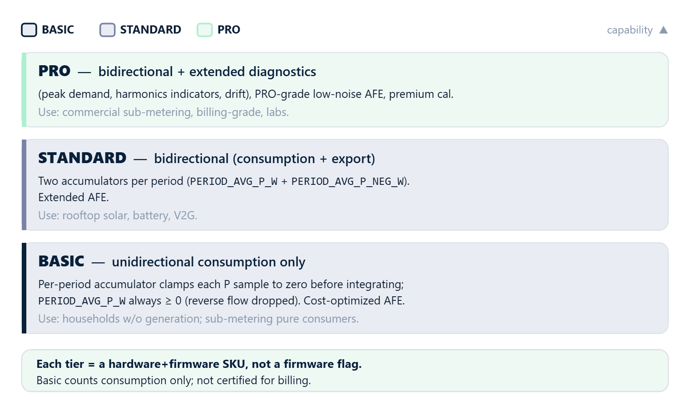

# 02 · Module tiers



## What a tier is

**rbAmp** ships in three tiers: **BASIC**, **STANDARD**, **PRO**.
A tier is a complete pairing of **hardware revision and firmware**, not
a software flag. Moving between tiers requires a physical SKU change,
not a firmware update.

From the perspective of the library and your code: **the `RbAmp` class
API is identical across all tiers**. The differences show up in which
values the module returns and how the firmware behavior interprets the
data (in particular — export to the grid).

## Current status

In the current rbAmp firmware, only the **BASIC** tier is implemented
and shipping. STANDARD and PRO are on the roadmap and not implemented.

| Tier | Shipping |
|---|---|
| **BASIC** | ✅ yes |
| **STANDARD** | ❌ planned |
| **PRO** | ❌ planned |

## BASIC — entry tier for consumer metering

### Hardware

A cost-optimized analog path suited to typical household loads. The
module includes an isolated analog front-end, an on-board power
regulator, and factory calibration stored in flash.

### Firmware behavior

The logic of a classic mechanical disk meter — **the count only moves
forward; export to the grid is not subtracted**.

The three "layers" of active-power values behave differently:

| Signal | Meaning | Behavior on BASIC |
|---|---|---|
| `dev.readPower(ch)` | instantaneous RT power, updated every ~200 ms | **signed** — a negative value is visible in real time (export) |
| `PERIOD_AVG_P_W` (inside `readPeriodSnapshot`) | average power over the period | each 200 ms window's average P is **clamped** to `max(P, 0)` before being added to the period accumulator |
| `dev.energy().wh(ch)` | Wh accumulated by the library | **monotonic** — consumption only; export is not counted |

In other words: the user **sees** export in the RT reading, but it is
absent from the library's Wh counter on BASIC.

### Typical use cases

- Households without on-site generation (no solar panels, wind
  turbines, or battery systems)
- Submeters for purely consuming loads (water heaters, motors,
  appliances)
- Building consumption monitoring where bidirectional metering is not
  required

### Bidirectional metering on BASIC (master-side)

If you need to track export to the grid separately on a BASIC module,
**do it on the master side**. The RT power `dev.readPower(0)` is
signed, so:

```cpp
double consume_wh = 0.0;
double export_wh  = 0.0;
uint32_t t_prev_ms = millis();

void loop() {
    // Sample RT power at 5 Hz — matches the firmware-commit cadence
    // (200 ms per channel). Faster gives empty repeat reads; slower
    // loses resolution on abrupt load transitions. ±2 % accuracy is
    // achievable for typical mixed loads with an inverter.
    //
    // delay() blocks the loop — incompatible with concurrent work
    // (LCD refresh, MQTT, networking). For sketches with other tasks,
    // replace it with a non-blocking millis() / scheduler pattern.
    delay(200);
    uint32_t t_now_ms = millis();
    float dt_s = (t_now_ms - t_prev_ms) / 1000.0f;
    t_prev_ms = t_now_ms;

    float p = dev.readPower(0);
    if (isnan(p)) return;

    double dwh = (double)p * dt_s / 3600.0;
    if (p >= 0) consume_wh += dwh;
    else        export_wh  += -dwh;
}
```

A complete working example is in [06_examples.md](06_examples.md) (the
`BidirectionalEnergy` scenario) and in [`examples/06_BidirectionalEnergy/`](https://github.com/rb-amp/rbamp-arduino/tree/main/examples/06_BidirectionalEnergy/).

## STANDARD — bidirectional tier *(planned)*

> This section describes **planned** functionality. It is not
> implemented in the current rbAmp firmware.

### What will be added

- **Hardware**: an extended analog stack for accurate measurement of
  both consumption and reverse flow
- **Firmware**: bidirectional metering — two separate per-period
  accumulators (consumption and export), exposed separately through
  additional registers (details after the STANDARD tier release)
- **Library API**: `dev.energy().wh(ch)` will start returning a signed
  net value (consumption − export) automatically, without master-side
  tricks

### Typical use cases (once available)

- Homes with rooftop solar generation
- Homes with wind turbines
- Battery storage systems
- Regenerative loads
- V2G (vehicle-to-grid) EV charging

## PRO — premium tier *(planned)*

> This section describes **planned** functionality. It is not
> implemented in the current rbAmp firmware.

### What PRO will add

- **Hardware**: a PRO-grade analog front-end (lower noise, tighter
  linearity), premium factory calibration, optional extended channel
  sets
- **Firmware**: bidirectional metering (as in STANDARD) plus
  additional diagnostic features — details in the specification after
  the PRO tier release
- **Library API**: extended diagnostic accessors (exact set after the
  firmware implementation)

### PRO use cases (once available)

- Submeters for commercial tenants
- Billing-grade accuracy installations
- Test and measurement labs
- Energy-intensive industrial loads

## How to detect the tier at runtime

The current firmware has no explicit "tier" register. Indirect
indicators are available:

```cpp
// Firmware version — opaque byte
uint8_t fw = dev.firmwareVersion();

// Presence of a voltage sensor (UI* variants vs I*-only)
bool voltage_hw = dev.hasVoltageHw();

// Number of current channels (1 / 2 / 3)
uint8_t channels = dev.channels();

// Full SKU — variant byte from REG_HW_VARIANT (0x55)
// 1=UI1, 2=UI2, 3=UI3, 4=I1, 5=I2, 6=I3
uint8_t variant = dev.hwVariant();
```

> **Note**: the indirect indicators above give different signals (the
> firmware version, the channel count, the presence of a voltage
> sensor, the SKU), but **they do not give the tier** — the current
> firmware is implicitly always **BASIC**. Use the SKU label on the
> module's enclosure as the source of truth for the tier. An explicit
> tier register will appear once STANDARD starts shipping.

## Where tier-dependent items are flagged in the documentation

Throughout the library text and the canonical documentation,
tier-dependent features are flagged explicitly, for example:

> **STANDARD / PRO only** — this register is not available on a BASIC
> module.

Or, conversely, BASIC-specific behavior:

> **BASIC**: the `dev.energy().wh(ch)` counter is monotonic — export
> to the grid is not counted. For bidirectional metering, see the
> `BidirectionalEnergy` example or use a STANDARD/PRO module.

## What's next

- [03 · Current sensor selection](03_sensor_selection.md) — which
  SCT-013 for which job
- [04 · Wiring](04_hardware.md) — hardware details
- [06 · Examples](06_examples.md) — scenarios for BASIC, including
  master-side bidirectional metering
- [09 · API reference](09_api_reference.md) — the full public API