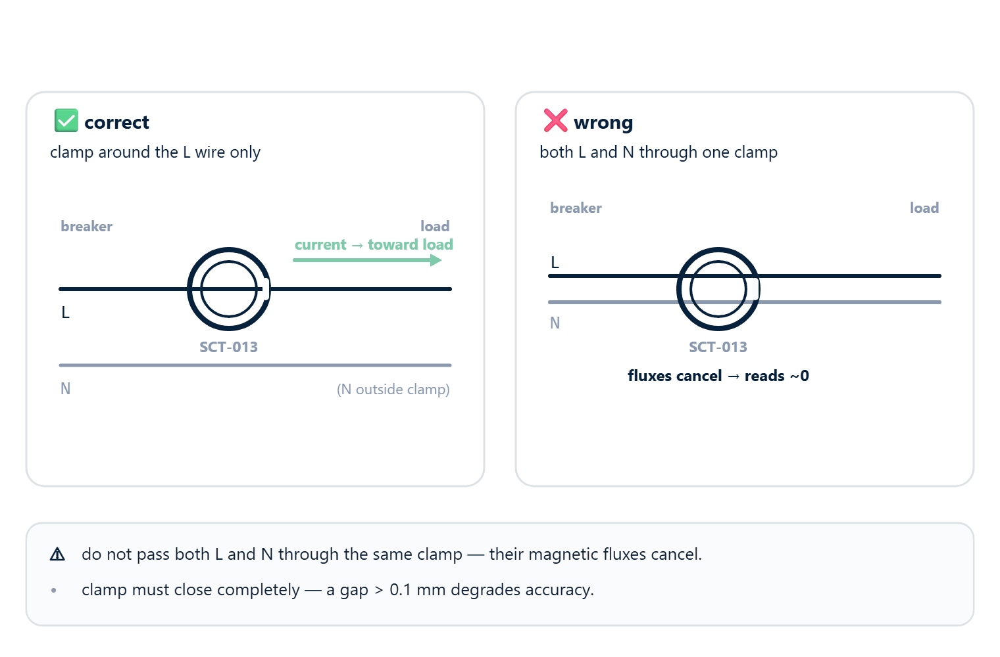
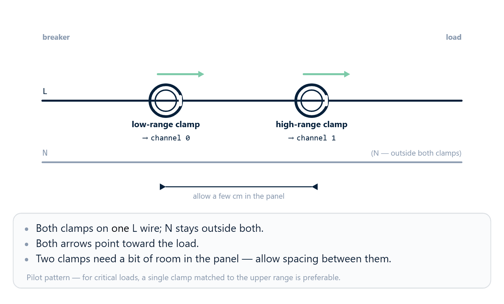

# 03 · Current sensor selection



This chapter answers two questions:

1. Which current sensor to choose for a given load.
2. How to tell the rbAmp module about your choice so that the factory
   calibration for that combination loads automatically.

The physical sensor connection (clamp orientation, L/N polarity
check) is covered in [04_hardware.md](04_hardware.md). This chapter is about
**model selection** and the **API call**.

## Sensor class

rbAmp modules work with CT clamps from the **SCT-013** family. The
sensor class is determined by the module's hardware revision and is
fixed at the factory — the user declares their choice via
`setSensorClass()` before picking a specific CT clamp model.

## Choosing an SCT-013 model

Within the SCT-013 family, five models are characterized on the
current bench setup (codes `{1, 2, 3, 4, 6}`); codes `5` and `7` are
present in the API and SPEC but are not yet validated and are
**rejected** by the library.

| `code` | Model | Current range | Status | Typical use |
|:---:|---|---|:---:|---|
| **1** | SCT-013-005 | 0…5 A | ✅ characterized | Small loads — lamps, low-power electronics, a single switch |
| **2** | SCT-013-010 | 0…10 A | ✅ characterized | One mid-power appliance — refrigerator, washing machine, air conditioner up to 2 kW |
| **3** | SCT-013-030 | 0…30 A | ✅ characterized | Mid-sized household service entrance — up to ~7 kW |
| **4** | SCT-013-050 | 0…50 A | ✅ characterized | Large service entrance — electric heating, EV charger, single-family home with peak loads |
| **5** | SCT-013-100 | 0…100 A | ⏳ uncharacterized | (Main service entrance of a home or small office; code reserved but requires bench validation.) |
| **6** | SCT-013-020 | 0…20 A | ✅ characterized | Medium service entrance — 3-4 kW appliances, heavy household appliances |
| **7** | SCT-013-060 | 0…60 A | ⏳ uncharacterized | (Industrial sub-meter; code reserved but requires bench validation.) |

> **Production-safe codes — `{1, 2, 3, 4, 6}`**. Use only the
> characterized codes in production. Attempting `dev.setCTModel(5)`
> or `dev.setCTModel(7)` (or passing such a code to
> `configureChannels(...)`) on the current hardware returns **`false`**
> with `lastError() == RB_ERR_PARAM` — the library will **not send** the
> write to the device (client-side guard). These codes will become
> available once the corresponding models have been bench-calibrated.
>
> Codes `0x06` and `0x07` are non-monotonic by rating — they were
> added after the original `0x01..0x05` set. Always choose by the
> rating you need, not by code order.

### How to choose the right model

The basic rule:

1. **Determine the maximum current** that can flow in the circuit
   (largest load + 30 % margin).
2. Pick the model whose range that value fits into.
3. **Do not over-spec by more than 5×**. An SCT-013-100 clamp on a
   circuit with a maximum current of 5 A will work, but it will give
   low resolution and high error at typical values.

### Headroom

An SCT-013 clamp operates without saturation within its rated range.
Brief peaks (compressor startup, inductive load) can exceed the
rating by 5-7× — this is **normal**, the clamp physically withstands
it, but the measurement becomes nonlinear above the rating.

If your load has a peak current above the clamp's rating, choose the
next size up. For example, for a washing machine with a 12 A inrush
current (and a 2-3 A rating during operation), an SCT-013-030 is
better than an SCT-013-005.

## Telling the module about your choice

**Two calls in the correct order are required** — first
`setSensorClass()`, then `setCTModel()`. If you call `setCTModel()`
before `setSensorClass()`, the module returns an `RB_ERR_PARAM` error
and the preset will NOT load.

> **The CT model is a functional preset, not a label.** Writing the CT
> model **immediately applies** the NF baseline, gain, and shape factor
> to the module's measurement pipeline; the current readings change.
> Changing the sensor_class resets the CT model to default (0) and
> requires re-setting it.

```cpp
#include <Wire.h>
#include <RbAmp.h>

RbAmp dev(Wire, 0x50);

void setup() {
    Wire.begin();
    while (!dev.begin()) { delay(500); }

    // Step 1: select the sensor family. REQUIRED before setCTModel().
    if (!dev.setSensorClass(RbAmpSensorClass::Sct013)) {
        // setSensorClass failed — check the connection, power, and address.
        return;
    }

    // Step 2: select the model within the family.
    if (!dev.setCTModel(RbAmpCTModel::Sct013_030)) {
        // Possible causes (any → RB_ERR_PARAM):
        //  1. setSensorClass() was not called before setCTModel()
        //  2. code not in the per-class accept-set (for Sct013: {1,2,3,4,6}; code 5 reserved)
        //  3. no factory preset for the selected class
        //     (applies to WiredCT / BuiltinCT in the current firmware)
        //  4. communication error (RB_ERR_IO, not RB_ERR_PARAM — a separate code)
        return;
    }
}
```

> **The library intentionally does NOT call `setSensorClass()` on the
> user's behalf**. If this step is skipped, `setCTModel()` returns
> `false` with `RB_ERR_PARAM` without writing to flash. This keeps the
> behavior predictable and explicit — no "magic" in the public API.

After these two calls:

- The module stores both values in flash — the setting survives a
  reset, a power-cycle, and a firmware re-flash.
- The calibration coefficients for that specific combination (sensor
  class + model) are loaded from the factory preset table. You do not
  need to touch any manual calibration registers.
- The next call to `dev.readCurrent(0)` already returns a value in
  amperes with the correct scaling.

**Total time for both calls** is about **1.4 seconds** (two flash-write
operations × ~700 ms each, limited by the flash page erase time). It
is done **once** at first installation; the setting is stored in flash
and is not repeated.

> If you already selected the sensor at first startup and are simply
> rebooting the controller, you do not need to repeat the
> `setSensorClass()` and `setCTModel()` calls — the module remembers
> the previous choice. But it does no harm either — calling again with
> the same value just rewrites the same byte.

### Verifying the setup

A simple sanity check after `setCTModel()`:

```cpp
void setup() {
    Wire.begin();
    while (!dev.begin()) { delay(500); }
    dev.setSensorClass(RbAmpSensorClass::Sct013);
    dev.setCTModel(RbAmpCTModel::Sct013_030);

    Serial.print(F("Ready. Connect a purely resistive load "));
    Serial.println(F("(for example, an incandescent lamp)."));
    Serial.println(F("Expect a steady PF ≈ 1.0 and positive P."));
}

void loop() {
    Serial.print(F("U=")); Serial.print(dev.readVoltage(), 1);
    Serial.print(F("V  I=")); Serial.print(dev.readCurrent(0), 2);
    Serial.print(F("A  P=")); Serial.print(dev.readPower(0), 1);
    Serial.print(F("W  PF=")); Serial.println(dev.readPowerFactor(0), 2);
    delay(2000);
}
```

On a purely resistive load (incandescent lamp, electric kettle,
heating element), expect:

- `U` ≈ 220–240 V (for 230 V mains)
- `I` ≈ matching the load's power (P / U)
- `P` > 0 and stable
- `PF` ≈ 1.0 (firmly positive)

If something doesn't add up, see [10_troubleshooting.md](10_troubleshooting.md).

## Modules with multiple current channels

### The SKU lineup — what fits the job

| SKU | I channels | U channel | Typical use |
|---|---|---|---|
| **UI1** | 1 | yes | A single load with **full power computation** (P, PF, Q, Wh) — a typical mains meter |
| UI2 | 2 | yes | **Roadmap** (deferred) — two independent loads on one phase with per-channel power |
| UI3 | 3 | yes | **Roadmap** — not buildable on the current MCU package (a 4th ADC channel is needed) |
| **I1** | 1 | no | Sub-meter without power computation (**current only**) — when a separate UI1 handles mains metering |
| **I2** | 2 | no | Two-channel current sub-meter — per-circuit breakdown |
| **I3** | 3 | no | Three-channel current sub-meter — per-circuit breakdown / dual-CT topology |

### What each channel measures

- **U channel** (UI* only): U_rms, U_peak, frequency. **One** per module.
- **I channels**:
  - on **UI variants** — each channel provides I_rms, I_peak, **P (active power)**, **PF**, avg_p over the period.
  - on **I variants** — **current only** (I_rms, I_peak). Active power and PF are not computed — they require voltage, which the I variant does not have. The `power[]`/`powerFactor[]` registers on I variants return **0**.
- **Single-phase module**: all I channels must be on the same phase to which the U channel is connected.

### Per-channel CT model — independent channel calibration

On multi-channel modules (`I2`, `I3`), each current channel has an
**independent** SCT-013 model selection. You can, for example, connect
an SCT-013-005 to channel 0 (a single outlet), an SCT-013-030 to
channel 1 (a stove circuit), and an SCT-013-020 to channel 2 (the
service entrance).

#### Method 1: `configureChannels()` — one call, one flash cycle (recommended)

```cpp
uint8_t models[3] = {1, 3, 6};   // ch0=SCT-013-005, ch1=SCT-013-030, ch2=SCT-013-020
dev.configureChannels(RbAmpSensorClass::Sct013, models, 3);
```

A single call configures the sensor class + all channels in one
operation with **one terminal** `SAVE_USER_CONFIG`. Measured on the
bench: ~1.4 seconds for a 1-SAVE vs ~3.5 seconds for 3 separate SAVE
cycles (`setCTModel()` + manual save). The key point — flash-cycle
wear is **3× lower** on the same flash page.

#### Method 2: per-channel `setCTModel(channel, code)` — any order

The API for per-channel selection is `setCTModel(channel, code)`:

```cpp
dev.setSensorClass(RbAmpSensorClass::Sct013);   // once for all channels

// v1.3: binding order is arbitrary.
dev.setCTModel(0, 1);   // SCT-013-005
dev.setCTModel(1, 3);   // SCT-013-030
dev.setCTModel(2, 6);   // SCT-013-020

dev.saveUserConfig();    // explicit save at the end (3-SAVE alternative, slower)
```

> ✅ **Binding order is arbitrary (v1.3 canon).** Writing `REG_CT_MODEL (0x05)`
> stages the value but does **not apply** it to any channel automatically.
> Application happens **only** through the per-channel `CMD_SET_CT_MODEL_CHn`,
> which takes the current staged value and writes it to its channel.
> Channels can be configured in any order (`setCTModel(0, ...)` first,
> last, or interleaved — it makes no difference); no clobber occurs. Any
> mention of "ascending / descending / bind ch0 last" in older documents
> and codebases refers to **pre-v1.3** behavior — it can be removed.
>
> That said, binding each channel remains **two-step** at the wire-protocol level (stage `REG_CT_MODEL` → bind `CMD_SET_CT_MODEL_CHn`); the library's `setCTModel(channel, code)` wraps both steps.

If all channels get the **same** model, the order doesn't matter
(the side-effect is idempotent):

```cpp
dev.setSensorClass(RbAmpSensorClass::Sct013);
dev.setCTModel(0, RbAmpCTModel::Sct013_005);
dev.setCTModel(1, RbAmpCTModel::Sct013_005);   // ch0 is rewritten with the same value — no effect
dev.setCTModel(2, RbAmpCTModel::Sct013_005);
```

> **Backward compatibility**: the integer overload `setCTModel(uint8_t code)` is retained. v1.3 mapping: `1`=`Sct013_005`, `2`=`Sct013_010`, `3`=`Sct013_030`, `4`=`Sct013_050`, `6`=`Sct013_020`. Code `5` (the former `Sct013_100`) is reserved in v1.3 firmware → `RB_ERR_PARAM`. The typed `RbAmpCTModel::Sct013_NNN` enum is the recommended form (the compiler will catch invalid values before the wire call). On multi-channel modules, the single-argument `setCTModel(code)` applies to channel 0 — equivalent to `setCTModel(0, code)`.

## Multi-channel modules — I2 and I3 (current-only)

The current hardware for multi-channel topology is **I2** (two current
channels) and **I3** (three current channels). Both modules **have no
U channel**, so P / PF / Q computation on the module side is not
possible — they provide **per-channel current** (I_rms, I_peak on each
channel) and nothing more.

UI2 and UI3 (with a U channel + multi-channel power) are listed on the
roadmap but **are not buildable on the current MCU package** (UI3 needs
a 4th ADC channel; UI2 is deferred). Use I2/I3 as current sub-meters
paired with a separate **UI1** at the service entrance, which provides
mains-energy + voltage.

### Reading channels (I2 / I3)

```cpp
float i0 = dev.readCurrent(0);   // ch0
float i1 = dev.readCurrent(1);   // ch1
float i2 = dev.readCurrent(2);   // ch2 — I3 only

// On an I variant readPower(...) returns 0.0 — this is by design.
float p_dummy = dev.readPower(0);  // = 0.0f
```

If you need **active power** on each sub-line, install a **UI1** at the
service entrance and split its total power proportionally to the
per-channel current `I[k]` from I2/I3. This is a typical home
deployment (see chapter [06 · Examples](06_examples.md), scenario 1).

> This is an **approximation**: splitting by current works when the PF
> is roughly the same across all loads. For accurate per-load power
> metering, use a UI variant on each line (once UI2/UI3 become
> available).

### I2 / I3 applications

- **Current sub-metering**: per-circuit current breakdown, a single
  installation point on the panel instead of a separate module per
  line.
- **Disaggregation paired with UI1**: UI1 provides mains-energy /
  power, I2/I3 break down consumption by branch (see chapter 06,
  scenario 1).
- **Current monitoring without power metering**: overload control,
  load on/off detection, an I(t) profile.
- **Dual-CT + a third channel** (I3): a large clamp on channel 0 for a
  wide range, a small clamp on channel 1 for accuracy at low currents,
  and the third channel for a separate auxiliary line. See the
  "Advanced setup: two clamps of different ratings" section below.

## Advanced setup: two clamps of different ratings on one wire

> ⚙ **An advanced pattern, not a basic one.** This section describes an
> optional technique for improving resolution at low currents. For
> most installations, a single clamp matched to the load range is
> enough. Use dual-CT only if you have a specific accuracy requirement
> at currents < 1 A.

### When this applies

- Multi-channel modules **I2 / I3** (current hardware).
- The same wire needs to be measured for both small loads (≤ 1 A) and
  peak events (≥ 5 A) with equal quality.
- A typical example: an apartment service entrance with 50-100 W of
  daytime standby and a 3+ kW kettle or stove startup in the evening.

### The idea

**Two** SCT-013 clamps of different ratings are installed on the same
wire:

- Channel 0 — a small clamp (for example, SCT-013-005, 5 A): sees
  small currents with better resolution and a lower noise floor.
- Channel 1 — a large clamp (for example, SCT-013-030 or higher):
  handles currents above the small clamp's overload point without
  saturating.

The master itself chooses which channel to use based on the current
value — while the small clamp is in its linear range, its reading is
more accurate; when exceeded, it switches to the large one.

### Configuration (any order — v1.3 canon)

The sensor class first **once**, then the per-channel models in any
order. On v1.3 firmware writing `REG_CT_MODEL` only **stages** a value;
binding happens through the per-channel command `CMD_SET_CT_MODEL_CHn`,
so channels never clobber each other. (The "descending order"
workaround applied to pre-v1.3 firmware only and is no longer required.)

```cpp
dev.setSensorClass(RbAmpSensorClass::Sct013);  // once

// Order is arbitrary — staging is decoupled from binding.
dev.setCTModel(0, RbAmpCTModel::Sct013_005);   // ch0 (range 0..5 A)
dev.setCTModel(1, RbAmpCTModel::Sct013_030);   // ch1 (range 0..30 A)
```

Final state: `ch0 = SCT-013-005`, `ch1 = SCT-013-030`. ✓

### Aggregation logic on the master side

The simplest pattern is to switch on a threshold:

```cpp
float read_combined_current(RbAmp& dev) {
    const float i_low  = dev.readCurrent(0);   // small clamp
    const float i_high = dev.readCurrent(1);   // large clamp

    // While the small clamp is well clear of saturation, it gives
    // better accuracy at low currents. We switch to the large one as
    // it approaches the overload point.
    //
    // The 4.5 A threshold for the SCT-013-005 is PROVISIONAL; the exact
    // value will be determined by bench validation (see below).
    // Behavior in the vicinity of the threshold is a matter of
    // measurement, not estimation.
    if (!isnan(i_low) && i_low < 4.5f) {
        return i_low;
    }
    return i_high;
}
```



<!-- MD028 separator -->

> ⚙ **Bench validation.** The exact figures for the dual-CT pattern
> (behavior near the threshold, temperature drift, the divergence of
> the two clamps in the overlapping range) are established by the
> factory bench-validation program. Until it is
> complete, treat dual-CT as a pilot pattern; for critical
> applications, a single clamp matched to the upper end of the load
> range is preferable.

### Approaches to improving sensitivity at low currents

If your load has a wide dynamic range (for example, 1 W standby for a
router vs a 2000 W immersion heater on the same outlet), a single
clamp sized for the upper limit loses the lower currents in the noise.

Three strategies in increasing order of complexity:

1. **Size the CT to the maximum, not "with margin"**. The most common
   mistake is putting an SCT-013-100 (100 A) on a household outlet with
   a typical consumption of 0.5–10 A. The signal sits in the lower
   1–10 % of the ADC — where the noise becomes comparable to the
   signal. For a household scenario (16 A outlet) an SCT-013-030 is
   optimal; for connecting a single device (≤ 5 A) an SCT-013-005.
2. **Dual-CT topology** (requires an I2/I3 SKU — two current channels on one module): a small clamp for the
   lower range + a large one for the upper range, with the master
   choosing by threshold. See the "Dual-CT topology" section above —
   the pattern is a pilot, and the numbers are being refined by the
   factory bench-validation program.
3. **Bench-calibrated noise floor** (factory-side): the factory
   bench-calibration program characterizes the noise floor on the test bench; the results are
   baked into the firmware's calibration array. On the user side,
   nothing needs to be done beyond `setSensorClass()` +
   `setCTModel()`. Until the program is complete, specific accuracy
   figures at low currents are not published.

## Production vs Develop mode (persistence reference)

The rbAmp module operates in two modes that differ in **what exactly is saved to flash**. The current mode is read from the corresponding status register.

| Command (opcode) | Production | Persists |
|---|---|---|
| `CMD_SAVE_USER_CONFIG` (0x32) | ✅ **OK** | `ct_model` / `sensor_class` / per-channel CT / `fleet_config` / `group_id` / `label` |
| `CMD_COMMIT_ADDR` (0x30, magic-armed) | ✅ **OK** | I²C address (see [04 · Connection](04_hardware.md) — changing the address) |
| `CMD_RESET` (0x01) | ✅ OK | — (software reset) |
| `CMD_LATCH_PERIOD` (0x27) | ✅ OK | — (period snapshot) |
| `CMD_CLEAR_ERROR` | ✅ OK | — |
| `CMD_SAVE_GAINS` | ❌ **BLOCKED** in production (silent reject; `REG_ERROR=0xFE`; reboot reverts) | gains / NF / phase (factory cal) |
| `CMD_FACTORY_RESET` | ❌ **BLOCKED** in production | — |

In production mode, writes of factory calibration (`CMD_SAVE_GAINS`, `CMD_FACTORY_RESET`) are **rejected by the firmware** — this protects against accidentally overwriting the factory coefficients. Deploying develop mode is a manufacturer-side operation.

> **Read-back ≠ persistence** (HW-verified A.7). The production guard accepts a write into RAM (a subsequent read returns what was written), but the flash save may be rejected. After a reboot the value **reverts**. **The only valid way to confirm persistence is to reboot the module via `CMD_RESET` and read again**:
>
> ```cpp
> dev.setCTModel(code);
> dev.reset();                     // CMD_RESET 0x01, works in production
> delay(300);                      // boot complete (root canon)
> uint8_t check = dev.ctModel(0);
> assert(check == code);           // ONLY now is persistence confirmed
> ```
>
> ✅ **`REG_I2C_ADDRESS (0x30)` reads the ACTIVE address at boot** (v1.3 Fix 4 addr-boot-sync). After a post-commit reboot, reading 0x30 will show the new active address. The staging echo (after a host write) remains by-design until `CMD_COMMIT_ADDR` + reset.

Cross-link: [09 · API reference](09_api_reference.md) — details on specific opcodes, [10 · Troubleshooting](10_troubleshooting.md) — what to do if persistence is not confirmed.

## What's next

- [04 · Connection](04_hardware.md) — physical clamp connection,
  arrow orientation, L/N polarity
- [05 · Quickstart](05_quickstart.md) — the full first-light sketch
- [06 · Examples](06_examples.md) — working scenarios for different
  loads
- [10 · Troubleshooting](10_troubleshooting.md) — what to do if the
  readings are odd (negative PF, unstable I, etc.)
