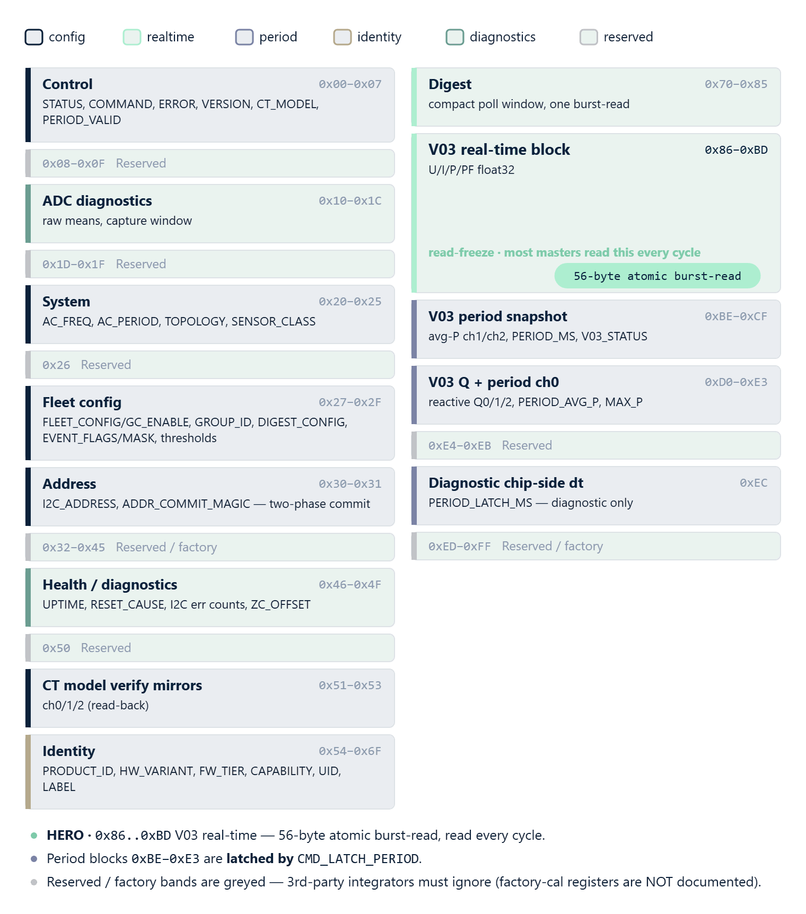

# 09 · API Reference




The complete public API of the `RbAmp` library v1.3.0 for Arduino. Source
of truth — the header files [`src/RbAmp.h`](https://github.com/rb-amp/rbamp-arduino),
[`src/RbAmpSnapshot.h`](https://github.com/rb-amp/rbamp-arduino),
[`src/RbAmpEnergy.h`](https://github.com/rb-amp/rbamp-arduino),
[`src/RbAmpRegisters.h`](https://github.com/rb-amp/rbamp-arduino) (the last one is
auto-generated and must not be edited by hand).

This chapter is a reference: signatures, return values, side
effects, edge cases. For working examples see
[06 · Examples](06_examples.md); for the quick start see
[05 · Quickstart](05_quickstart.md).

## Header files

| Include | What it brings in |
|---|---|
| `<RbAmp.h>` | All public types (pulls in the rest) |
| `<RbAmpSnapshot.h>` | `RbAmpSnapshot`, `RbAmpPeriodSnapshot`, `RbAmpTopology`, `RbAmpSensorClass` |
| `<RbAmpEnergy.h>` | `RbAmpEnergy` |
| `<RbAmpRegisters.h>` | Auto-generated protocol constants — `RB_OK`, `RB_ERR_*`, `SETTLE_MS_*` |

A user sketch normally only needs `#include <RbAmp.h>` — the rest
are pulled in transitively.

## `RbAmp` class

The main client. One instance per slave device on the I²C bus.
Multiple instances can share a single `TwoWire` bus to poll several
modules.

### Constructor

```cpp
explicit RbAmp(TwoWire& bus,
               uint8_t addr = 0x50,
               RbAmpTopology hint = RbAmpTopology::Single) noexcept;
```

| Parameter | Description |
|---|---|
| `bus` | Reference to the `TwoWire` bus (usually `Wire`). The caller must call `bus.begin()` BEFORE `begin()`. |
| `addr` | 7-bit slave address. Range 0x08..0x77, default 0x50. |
| `hint` | Topology hint: the number of current channels (1/2/3). On pre-v1.3 firmware `begin()` cannot reliably determine the variant, so the hint is used as a fallback for multi-channel SKUs. Defaults to `Single` — the safe default, which does not trigger spurious reads of absent channels. For multi-channel modules on pre-v1.3 firmware, pass the matching hint explicitly. |

The constructor generates no I²C traffic.

### Lifecycle methods

#### `bool begin() noexcept`

Probe the device, commit the topology, prime LATCH.

Sequence:

1. Read `REG_VERSION` (0x03). If the device did not ACK — `false`
   with `RB_ERR_NACK`. If it returned `0x00` / `0xFF` — `false` with
   `RB_ERR_VERSION`.
2. Cache the topology from the constructor (`hint`) — on the current
   firmware `begin()` does not auto-probe the variant. After this,
   `topology()` / `channels()` return valid values without touching
   the bus.
3. Read `U_rms` to determine whether a voltage sensor is present
   (threshold 1.0 V).
4. Write `CMD_LATCH_PERIOD` as a primer + wait 50 ms. The first
   snapshot after power-on is discarded (it is not handed to user
   code — it mixes in pre-power-on data).
5. Store `millis()` for subsequent energy integration.

Idempotent: safe to call again.

**Returns**: `true` on success; `false` otherwise — see
`lastError()` for details.

#### `bool probe() noexcept`

A lightweight liveness check. A single read of `REG_VERSION` with no
side effects.

**Returns**: `true` if the slave ACKed and reported a supported
version (neither `0` nor `0xFF`).

#### `bool waitReady(uint32_t timeout_ms = 1000) noexcept`

Polls the module's ready flag until bit 0 is set. Useful after
power-on — the module may need up to 200 ms for its first RT window.

**Returns**: `true` if the bit was seen before `timeout_ms` elapsed;
`false` with `RB_ERR_TIMEOUT` otherwise.

#### `uint8_t firmwareVersion() noexcept`

**Returns**: the `REG_VERSION (0x03)` byte. Known values:
`0x01` = v1.0, `0x02` = v1.1, `0x03` = v1.2, `0x04` = v1.3 (current
production). `0` or `0xFF` indicate an I²C error (see `lastError()`).

#### `RbAmpTopology topology() const noexcept`

**Returns**: the cached topology (the value from the constructor or
from `REG_TOPOLOGY 0x24`). No bus access.

#### `uint8_t channels() const noexcept`

**Returns**: 1, 2, or 3 — the number of current channels derived
from `topology()`.

#### `bool hasVoltageHw() const noexcept`

**Returns**: `true` if a voltage sensor was detected at `begin()`
(U_rms > 1.0 V). Cached, no traffic.

#### `uint8_t address() const noexcept`

**Returns**: the current 7-bit I²C address. Updated after a
successful `commitAddressChange()`.

#### `uint8_t rawTopology() noexcept`

A direct read of `REG_TOPOLOGY` (0x24). Unlike `topology()`, this
performs an I²C transaction.

**Returns**:

- `1`/`2`/`3` — `SINGLE`/`SPLIT_PHASE`/`THREE_PHASE`.
- `0xFF` — I²C error.

> For full SKU detection use `hwVariant()` (reads
> `REG_HW_VARIANT 0x55` — returns 1=UI1, 2=UI2, 3=UI3, 4=I1, 5=I2, 6=I3).

### Real-time reads (RT block, 200 ms refresh)

All methods return `float`. On error they return `NAN` and set
`lastError()`. Under the hood a retry + sanity filter is used for
robustness against rare link glitches on ESP-IDF (see the diagnostic
counters below).

#### `float readVoltage(uint8_t phase = 0) noexcept`

Instantaneous RMS voltage. On the current firmware only `phase = 0`
is supported — other values return `NAN` with `RB_ERR_PARAM`.

#### `float readVoltagePeak(uint8_t phase = 0) noexcept`

Peak voltage over the RT window.

#### `float readCurrent(uint8_t ch = 0) noexcept`

Instantaneous RMS current on a channel. `ch` must be < `channels()`
— otherwise `NAN` with `RB_ERR_PARAM`.

#### `float readCurrentPeak(uint8_t ch = 0) noexcept`

Peak current on a channel over the RT window.

#### `float readPower(uint8_t ch = 0) noexcept`

Instantaneous active power on a channel. **Signed** — a negative
value means export (the load feeds power back into the grid, relevant
for PV / bidirectional installations).

#### `float readPowerFactor(uint8_t ch = 0) noexcept`

Power factor on a channel. Dimensionless, range −1..+1.

#### `float readFrequency() noexcept`

Grid frequency. Returns `50.0` or `60.0` Hz on a healthy grid.

#### `bool readAll(RbAmpSnapshot& out) noexcept`

The complete RT block in a single call, into a `RbAmpSnapshot`
struct. Equivalent to sequential `readVoltage()` + `readVoltagePeak()`
+ `readCurrent(0..N)` + `readCurrentPeak(0..N)` + `readPower(0..N)` +
`readPowerFactor(0..N)` + `readFrequency()`. Unused channels (beyond
`channels()`) are filled with zeros.

**Returns**: `true` on success; `false` if any single read failed —
`lastError()` holds the code of the first error.

### Period metering

See [01 · Overview](01_overview.md) for the big picture and
[05 · Quickstart](05_quickstart.md) Step 5 for a minimal template.

#### `bool latchPeriod() noexcept`

Writes `CMD_LATCH_PERIOD` (0x27) to `REG_COMMAND`. Does not wait —
the caller itself must observe the 50 ms settle and check
`isPeriodValid()` before reading.

For most tasks use `readPeriodSnapshot()` — it encapsulates the
entire sequence.

**Returns**: `true` on a successful write.

#### `bool isPeriodValid() noexcept`

Reads the latch ready bit. `true` if the last snapshot is fresh and
ready to read.

#### `float readPeriodAvgPower(uint8_t ch = 0) noexcept`

Average active power on a channel over the latched period. Must be
called after `latchPeriod()` + 50 ms settle + valid check.

#### `float readPeriodMaxPower() noexcept`

Peak instantaneous power on channel 0 over the latched period.

#### `uint32_t readPeriodLatchMs() noexcept`

Period duration from the **device's** point of view, in ms.

> **Diagnostic value.** The module's internal timer has limited
> accuracy (a few percent). For energy integration use the master
> wall-clock (`master_dt_ms` from `RbAmpPeriodSnapshot`), not this
> field.

#### `bool readPeriodSnapshot(RbAmpPeriodSnapshot& out, uint16_t settle_ms = 50, bool skip_latch = false) noexcept`

**The recommended entry point** for period metering. The full
sequence under the hood:

1. If `skip_latch == true` — skip the LATCH write (applies after
   `broadcastLatch()` or a manual series of LATCH commands).
2. Otherwise — write `CMD_LATCH_PERIOD`.
3. Capture `millis()` to compute `master_dt_ms`.
4. `delay(settle_ms)` — 50 ms by default per the protocol
   specification.
5. Check the latch ready flag. If 0 — set `RB_ERR_STALE` and record
   the timestamp (so the next snapshot does not double-count by
   `dt`).
6. Read `avg_p[0..channels-1]` + `max_p` + `latch_ms`.
7. Update the timestamp + call `energy().tick(out, channels_)` for
   automatic Wh integration.

| Parameter | Description |
|---|---|
| `out` | Output struct. |
| `settle_ms` | Wait after LATCH, 50 by default. |
| `skip_latch` | If `true` — do not write LATCH, only read (for a synchronized multi-board scene). |

**Returns**: `true` if `out.valid == true`; `false` if the read
failed or the snapshot is stale.

### Energy metering (master-side accumulator)

#### `RbAmpEnergy& energy() noexcept`

#### `const RbAmpEnergy& energy() const noexcept`

Access to the per-channel Wh accumulator owned by this `RbAmp`
instance. The accumulator is updated automatically on every
successful `readPeriodSnapshot()`. For details see the "`RbAmpEnergy`
class" section below.

### Sensor configuration

A two-step sequence: first the sensor class, then the model. **Both
steps are mandatory.**

For a detailed model-selection guide see [03 · Current sensor selection](03_sensor_selection.md).

> **CT model — a functional preset, not a label.** Writing the CT
> model immediately applies the NF baseline, gain, and shape factor —
> the current readings change. Changing the `RbAmpSensorClass` resets
> `REG_CT_MODEL = 0`.

#### `bool setSensorClass(RbAmpSensorClass cls) noexcept`

Set the current sensor class with a save to flash.

Sequence: write `REG_SENSOR_CLASS` (0x25) → `CMD_SAVE_USER_CONFIG` (0x32)
→ wait 700 ms (flash erase). Blocking. **Production-OK** —
`SAVE_USER_CONFIG` is not gated.

Must be called **before** `setCTModel()`. Otherwise `setCTModel()`
returns `false` with `RB_ERR_PARAM`. It also resets `REG_CT_MODEL`
to 0 on the device side (protection against mixing a class and a
model through an incomplete reconfiguration).

| Argument | Meaning |
|:---:|---|
| `RbAmpSensorClass::Sct013` | SCT-013 series (the only shipping class) |

**Returns**: `true` on success.

#### `bool setCTModel(uint8_t code) noexcept`

The single-parameter form — sets the CT clamp model **on channel 0
only**. Convenient for single-channel SKUs (UI1/I1); on multi-channel
ones it is equivalent to `setCTModel(0, code)`.

Sequence: write `REG_CT_MODEL` (0x05) → `CMD_SET_CT_MODEL_CH0` (opcode 0x28) → 5 ms settle → `CMD_SAVE_USER_CONFIG` (opcode 0x32) → 700 ms. **Production-OK** — uses the user-config save path, no factory-mode gating.

| `code` | Model |
|:---:|---|
| 1 | SCT-013-005 |
| 2 | SCT-013-010 |
| 3 | SCT-013-030 |
| 4 | SCT-013-050 |
| 6 | SCT-013-020 |

A `code` outside the valid set `{1, 2, 3, 4, 6}` for the `Sct013` class → `false` with `RB_ERR_PARAM`. Code `5` is reserved in v1.3 firmware (the former `SCT-013-100`) and returns `DEV_ERR_PARAM`. For the full per-class accept-set see [03 · Current sensor selection](03_sensor_selection.md#per-class-ct-validation).

For multi-channel modules use the per-channel form below.

#### `bool setCTModel(uint8_t channel, uint8_t code) noexcept`

The per-channel form. Sets the CT clamp model on a specific channel.

Under the hood: write `REG_CT_MODEL` (0x05) → command `CMD_SET_CT_MODEL_CH0/1/2`
(opcode 0x28/0x29/0x2A) according to `channel` → 5 ms settle → `CMD_SAVE_USER_CONFIG`
(opcode 0x32) → 700 ms. **Production-OK** — the user-config save path is the
production persistence channel for `ct_model` / `sensor_class` / per-channel CT.

> **Call order is arbitrary on v1.3 (Fix-A canon).** Writing
> `REG_CT_MODEL (0x05)` only **stages** a value — it is **not** auto-
> applied to channel 0. Application happens **exclusively** through
> the per-channel opcode `CMD_SET_CT_MODEL_CHn` (0x28 / 0x29 / 0x2A),
> which copies the staged value into its own channel. Channels can
> therefore be configured in any order — ascending, descending, or
> interleaved — without clobber:
>
> ```cpp
> dev.setCTModel(0, 1);   // channel 0 = SCT-013-005
> dev.setCTModel(1, 3);   // channel 1 = SCT-013-030
> dev.setCTModel(2, 6);   // channel 2 = SCT-013-020
> ```
>
> Resulting state: ch0=preset 1, ch1=preset 3, ch2=preset 6. ✓
>
> Any "descending order" / "bind ch0 last" guidance refers to **pre-v1.3
> firmware** behavior and is no longer required.

`RB_ERR_PARAM` guard on the `setSensorClass()` precondition, same as
in the single-parameter form.

#### V2 verify mirrors — `CT_MODEL_CH0/1/2 (0x51-0x53)`

Read-only registers that reflect the CT preset actually applied on
each channel. The write wire-protocol **does not change** — writes
use the mechanism above (`REG_CT_MODEL + CMD_SET_CT_MODEL_CHn`).
0x51-0x53 are merely a read-back for verifying state and for
read-compare-write patterns:

```cpp
uint8_t applied_ch0 = dev.readReg(0x51);   // what is actually applied
uint8_t applied_ch1 = dev.readReg(0x52);
uint8_t applied_ch2 = dev.readReg(0x53);
```

**Returns**: `true` on success.

#### `bool saveGains() noexcept` — factory-mode only

A "bare" `CMD_SAVE_GAINS` (0x26) write — the **factory** persistence
path for calibration coefficients (gains / noise floor / phase).

> ⚠ **Factory-only. BLOCKED in production.** On a production module
> `CMD_SAVE_GAINS` is rejected by the firmware — the call returns
> `false`, `REG_ERROR` is set to `DEV_ERR_PARAM` (0xFE), and the next
> reboot reverts any RAM-only writes. For all user-facing persistence
> (sensor class, CT model per channel, address, fleet config, label)
> use `saveUserConfig()` (`CMD_SAVE_USER_CONFIG`, opcode 0x32) — that
> is the production-OK persistence path. `saveGains()` is exposed in
> the API for completeness; user code in a deployment context **should
> not call it**.

**Returns**: `true` on a successful command write (production: always
`false` with `RB_ERR_MODE`).

#### `bool prepareAddressChange(uint8_t new_addr) noexcept`

Step 1 of 2 for changing the module's I²C address. **Production-OK** on the current firmware (v1.3 two-phase commit, no factory-mode gating for the address).

Sequence: validate the `new_addr` range (0x08..0x77, ≠ current) → write the candidate to `REG_I2C_ADDRESS (0x30)` in RAM → write magic `0xA5` to `REG_ADDR_COMMIT_MAGIC (0x31)` — armed. The caller must call `commitAddressChange()` within 5 seconds, otherwise the arming expires.

**Returns**: `true` if armed successfully.

#### `bool commitAddressChange() noexcept`

Step 2 of 2. Must be called within 5 seconds of `prepareAddressChange()`.

Sequence: check the freshness of the magic-armed state → `CMD_COMMIT_ADDR (opcode 0x30)` → persist to flash → `CMD_RESET (0x01)` → ~300 ms boot-to-responsive → update the internal address field. After this, all calls on this instance address the new address.

> ⚠ **Re-enumeration after commit.** After a successful commit the device resets and re-enumerates at the NEW address. Subsequent calls on this `RbAmp` instance address the new address transparently — but any OTHER master on the bus (a Python script, an ESP-IDF component on another MCU, a debug probe) will keep thinking the device is at the old address until its internal state is updated by hand.

> ⚠ **Verification path** (v1.3 Fix 4): after reboot `REG_I2C_ADDRESS (0x30)` reads the **active address**. A bus scan at the new address also works to confirm the commit.

> Historical: before the v1.3 fixes the address change was incorrectly documented as factory-only. Per the v1.3 A2 canon it is a **production operation**.
> The I²C address — the documented path is reconfiguration via the
> factory bench (outside the library's scope).

An additional note for `commitAddressChange()`:

> ⚠ **Restart and re-enumeration after commit.** After a successful
> commit the device resets and re-enumerates at the NEW address.
> Subsequent calls on this `RbAmp` instance address the new address
> transparently — but any OTHER master on the bus (a Python script,
> an ESP-IDF component, a debug probe) will keep thinking the device
> is at the old address until its internal state is updated by hand.

If the arming window has expired, `commitAddressChange()` returns
`false` with `RB_ERR_TIMEOUT` and clears the arming flag — a fresh
`prepareAddressChange()` will be required.

**Returns**: `true` on success.

#### `bool factoryReset() noexcept`

The `CMD_FACTORY_RESET` command (0xAA) + wait 1500 ms.

> ⚠ **Destructive operation.** Erases ALL flash parameters (CT
> model, sensor class, calibration coefficients, I²C address). The
> module returns to its factory defaults — `RbAmpSensorClass`
> becomes `Unset`, `REG_CT_MODEL` becomes 0. Any setting previously
> applied via `setSensorClass()` / `setCTModel()` is gone. The next
> user MUST re-apply both `setSensorClass()` and `setCTModel()`
> before metering works again. This is **not a "soft restart"** —
> for a soft restart use `reset()`. `factoryReset()` is reserved for
> recovery from a known-bad state or for handing the module off to
> another user / another installation.

**Returns**: `true` on a successful command write.

#### `bool reset() noexcept`

The `CMD_RESET` command (0x01) + wait 100 ms. A soft restart of the
device without losing flash parameters.

**Returns**: `true` on a successful command write.

### Multi-module bus (static)

#### `static bool broadcastLatch(TwoWire& bus) noexcept`

Sends an I²C General-Call broadcast latch (`A5 27 00 tick_lo tick_hi`
to address `0x00`) — all modules with GC enabled latch the period
simultaneously. On v1.3 firmware GC is supported as an **opt-in
capability**: per-module enable via `REG_FLEET_CONFIG.bit0` (cleared by
default), capability bit `CAP_GC_LATCH` (bit 1) in `REG_CAPABILITY
(0x57)`. The library checks the capability bit before broadcasting.

**Return semantics**:

- **v1.3 firmware, GC enabled on at least one module** — returns `true`,
  the fleet latches in sync (skew < 1 ms across modules).
- **v1.3 firmware, GC disabled on all modules** — `Wire.endTransmission()`
  to `0x00` NACKs at the bus level → returns `false`. Fix: enable GC
  per module via `enableGc(true)` (writes `FLEET_CONFIG.bit0` +
  `SAVE_USER_CONFIG` + reset), or use `RbAmpFleet::enableGcAll()`.
- **Legacy firmware without the `CAP_GC_LATCH` capability** —
  returns `false` without touching the bus. Fall back to a sequential
  series of `latchPeriod()` on each device — see
  [06 · Examples](06_examples.md), the multi-module bus section.

### Diagnostics

#### `int8_t lastError() const noexcept`

**Returns**: the code of the last error — `RB_OK` (0) or one of the
`RB_ERR_*` values (negative). The full table is in the "Error codes"
section below + [10 · Troubleshooting](10_troubleshooting.md).

#### `static const char* errorString(int8_t code) noexcept`

**Returns**: a constant string with a human-readable description of
the error code. Never returns `NULL`.

#### `void setLogStream(Stream* stream) noexcept`

An optional diagnostics sink. If set, the library briefly logs the
results of `probe()`, stale snapshots, and mode rejections. Pass
`nullptr` to turn it off. Off by default.

Typical use:

```cpp
dev.setLogStream(&Serial);
```

#### `uint32_t retryExhaustionCount() const noexcept`

How many times since power-on (or the last `resetCounters()`) the
retry loop was exhausted during a single-byte read. The steady-state
value is **0**. A non-zero value is a sign of link problems (see
[10 · Troubleshooting](10_troubleshooting.md)).

#### `uint32_t sanityRejectCount() const noexcept`

How many raw float values were rejected by the sanity filter
(`!isfinite(x) || |x| > 10000`). Steady-state — **0**. A non-zero
value after retry mitigation usually means a rare ESP-IDF I²C-stack
artifact that survived the retry layer.

#### `void resetCounters() noexcept`

Zero both counters. Use it at the start of a soak test or a
regression window to measure only the events within the window.

## Identification and provisioning (v1.3)

These methods let the master understand **exactly what** is connected
to the bus (variant, capability bit-map, UID, label) and prepare a
new or freshly flashed module for operation (provisioning + saving
the configuration to flash).

### `uint8_t readVariant() noexcept`

Reads the module's `HW_VARIANT (0x55)` register. Values:

| Code | SKU | I channels | U channel |
|---|---|---|---|
| `1` | UI1 | 1 | yes |
| `4` | I1 | 1 | no |
| `5` | I2 | 2 | no |
| `6` | I3 | 3 | no |

Codes `2` (UI2) and `3` (UI3) are reserved for roadmap variants and
do not occur on the current hardware. The method does no caching —
it returns the "raw" byte; on v1.3 it is stable (read-only,
ROM-stored).

> **Variant autodetect via `readVariant()` is the recommended path**.
> On v1.3 the constructor topology hint remains as a **fallback for
> pre-v1.3 firmware** (where `HW_VARIANT` is not yet documented).
> Default hint = `Topology::Single` — safe, it does not trigger
> spurious reads of absent channels on UI1/I1.

### `bool readCapability(uint16_t& out) noexcept`

Reads the 16-bit feature map from the `CAPABILITY (0x57/0x58)`
registers, little-endian u16. Bit 8 (`0x0100`) indicates the
presence of a voltage front-end: if the bit is clear, the module does
not compute P / PF / energy and the values of those registers are
`0`. Bit 1 (`0x0002`, `CAP_GC_LATCH`) indicates support for the
General-Call broadcast latch (see `broadcastLatch()` above). The full
bit map is published in the rbAmp API reference.

Reading CAPABILITY as a full 16-bit value is the v1.3 canon (a
firmware fix ensures the low byte is correct). For a
backward-compatible extraction of `has_voltage` it is enough to read
the high byte (`0x58`): `bool has_voltage = read_u8(0x58) & 0x01`.

### `bool hasVoltage() noexcept`

A convenience helper over `readCapability` — returns `true` if the
module has a U channel (bit 8). Cached inside the handle on the first
call; subsequent calls require no I²C operation.

### `uint8_t readProductId() noexcept`

Reads `PRODUCT_ID (0x54)` — the byte identifier of the family
(rbAmp = `0x01`). Used by the fleet scanner to confirm that the
device at an address really is an rbAmp and not some other I²C slave
that happened to respond at the same address.

### `bool readUid(uint8_t uid[12]) noexcept`

Reads the 96-bit unique MCU identifier from `UID (0x5C..0x67)` in a
single burst operation. The UID is guaranteed unique for every
module and does not change on re-flash — convenient for serial logs,
master-side anti-clone checks, and identification when a module is
replaced in a deployed fleet.

### `bool readLabel(char out[9]) noexcept`

Reads the 8-byte user label from `LABEL (0x68..0x6F)`. ASCII,
zero-padded; the result is always null-terminated (a 9-byte array =
8 data bytes + the terminating `\0`). An empty label = unset.

### `bool writeLabel(const char* label) noexcept`

Writes the 8-byte label. Accepts a null-terminated string — extra
bytes are truncated, missing ones are padded with zeros. The write
is **byte-at-a-time** for multi-byte writes (the rbAmp wire protocol
auto-increments **register reads** in burst mode, but not register
writes — see [Wire-protocol details](#wire-protocol-details) below;
the library does the byte loop automatically). After the write you
need `dev.saveUserConfig()` so the label survives a reset.

### `bool isProvisioned() noexcept`

Checks whether the module has gone through initial provisioning.
Technically it checks `REG_ERROR != 0xFB (DEV_ERR_FLASH_PARAMS_BAD)`
on a freshly booted module — `0xFB` is set by the firmware when the
user-config block is empty / corrupt. A module fresh from the factory
returns `false` — it needs `saveUserConfig()` (or provisioning via
`RbAmpFleet::provision()`) after the first configuration of the CT
model and address.

> On v1.3 this code is **normal** for a virgin module (not fatal). Do
> not abort provisioning on the first sight of `0xFB`.

### `bool saveUserConfig() noexcept`

Issues `CMD_SAVE_USER_CONFIG (opcode 0x32)` — saves the user-config
block to flash: `SENSOR_CLASS`, `CT_MODEL` per channel,
`I2C_ADDRESS`, `FLEET_CONFIG`, `GROUP_ID`, `LABEL`. It does **not
save** factory-cal parameters — those are under a separate
`CMD_SAVE_GAINS`, locked in production mode.

Blocks the thread for ~700 ms (flash erase + write cycle). For the
duration of the call, do not try to access the module from other
tasks.

> **Read-back ≠ persistence**: confirming that a value was written to
> flash requires a **reboot + a re-read**. See the "v1.3 error model"
> section below.

## v1.3 error model — two independent channels

Errors have **two independent channels** that work in different ways.
Understanding the difference is critical to interpreting the module's
state correctly.

| | Channel A — client-side, sync | Channel B — DUT-side, durable async |
|---|---|---|
| **Where it lives** | Validation inside the library (Arduino lib) | `REG_ERROR (0x02)` + `EVENT_FLAGS.bit3` (`0x2A`) |
| **When it fires** | Before the I²C transaction (the lib stops it) | After the FW accepted the write and rejected it |
| **What the master sees** | the setter returns `false` + `lastError() == RB_ERR_PARAM`; `REG_ERROR` on the device **stays 0x00** | `REG_ERROR` = the failure code immediately; `bit3` latches **~200-300 ms** after the transaction |
| **Sticky** | no (just a bool return) | `REG_ERROR` last-write; `bit3` sticky W1C |
| **Typical path** | An argument outside the allowed bounds (channel ∉ {0,1,2}, code ∉ the characterized set, sensor_class out-of-enum) | A raw register write the library does not pre-validate (low-level use of `writeReg()` with an invalid mask) |

### Channel A — client-side validation (library setters)

All library setters (`setSensorClass`, `setCTModel`,
`setCTModel(ch, code)`, `configureChannels`, etc.) first **check the
arguments** against the allowed values. If an argument is out of
range, the setter returns `false` and sets
`lastError() == RB_ERR_PARAM`, **without performing any I²C
transaction at all**. Accordingly, `REG_ERROR` on the device is
**not touched**:

```cpp
if (!dev.setCTModel(/*ch=*/99, /*code=*/3)) {       // client-side guard
    Serial.print(F("rejected: "));
    Serial.println(dev.lastError());                 // RB_ERR_PARAM (lib cached)
    uint8_t reg_err;
    dev.readLastError(reg_err);                      // device REG_ERROR byte
    Serial.println(reg_err, HEX);                    // 0x00 — REG_ERROR untouched
}
```

> **`lastError()` vs `readLastError()` — two different channels, not
> synonyms.** `lastError()` returns the **lib-side cached** `RB_ERR_*`
> code from the previous call — **with no I²C operation**.
> `readLastError(out)` does a **single wire read** of the device's
> `REG_ERROR (0x02)` register — the last-write outcome from the
> firmware side. In Channel A (above), `lastError()` = `RB_ERR_PARAM`
> while `readLastError()` = `0x00` (the lib never reached the wire —
> REG_ERROR untouched). In Channel B (below) both will show a code,
> but differently: `lastError()` — the last cached lib semantics;
> `readLastError()` — the exact value of the REG_ERROR byte right now.

This means: if you want to know **exactly why** a setter refused, the
reliable source is the function's **return code** + `lastError()`.
`REG_ERROR` on the device will tell you nothing in this scenario.

### Channel B — DUT-side rejection (durable async)

If the write **went through I²C** (the lib did not stop it because
the argument looked valid) but the **firmware rejected** it, the
second channel kicks in:

- **`readLastError(out)`** immediately holds the reason code (for
  example, `0xFE = DEV_ERR_PARAM`). This is the last-write outcome:
  any next successful write will overwrite it. You must read it
  **immediately** after your write, before any other transaction.
- **`hasError(out)`** — the sticky W1C indicator `EVENT_FLAGS.bit3`.
  It **does not latch instantly**: on the bench a **~200-300 ms
  delay** was measured between the failed transaction and bit3 being
  set. Right after the write bit3 is still `false`; after 300 ms it
  is `true`. After that, `bit3` holds across any number of reads.

> ⚠ **Do not use `hasError()` to validate a write you just made.**
> For the outcome of **this specific write** only `readLastError()` is
> reliable, read **immediately** after the write before any other
> transaction (plus the setter's return code, if it has one).
> `hasError()` is an async channel for polling-style monitoring of
> "did anything fault between two checks", not for synchronous
> validation.

### Clearing a durable error — clear both (REG_ERROR and bit3)

`bit3` is picked up by the firmware every ~200-300 ms from the
current state of `REG_ERROR`. So a plain `clearEventFlags(1 << 3)`
**will not work** — bit3 will immediately be **re-set** from the
not-yet-cleared `REG_ERROR`. The correct order: first `clearError()`
(clears `REG_ERROR`), then `clearEventFlags(1 << 3)` (clears the
sticky latch). If you want atomicity — there must be no rejected
write between them.

### `bool readLastError(uint8_t& out) noexcept`

Reads the device's `REG_ERROR (0x02)` register directly (a single
wire read) — the outcome of the **last transaction successfully
accepted by the bus** (a write or a command). Not sticky: any next
successful write overwrites it with its own outcome. Used in Channel
B (DUT-side rejection) for the extended reason code.

> **Not to be confused with `lastError()`**: that is a **different**
> method, which returns the library-cached `RB_ERR_*` from the
> previous lib call **with no I²C operation**. See the callout in
> Channel A above.

### `bool hasError(bool& out) noexcept`

A convenience helper over `EVENT_FLAGS.bit3`. Returns `true` in `out`
if bit3 is set. Sticky W1C; not cleared until an explicit clear (with
a caveat — see the "Clearing a durable error" section above).

### `bool readEventFlags(uint8_t& out) noexcept` / `bool clearEventFlags(uint8_t mask) noexcept`

`EVENT_FLAGS (0x2A)` — a byte of sticky flags; the specific bits are
described in the specification (including `ERROR_OCCURRED` bit3).
Clear is write-1-to-clear: write a mask with ones in the bits you
want to reset.

### `bool clearError() noexcept`

Issues `CMD_CLEAR_ERROR (opcode 0x31)` — zeros `REG_ERROR`.
**Required to clear a durable error** paired with
`clearEventFlags(1 << 3)` (see above). Without `clearError()`, a
simple `clearEventFlags(1 << 3)` will leave bit3 `true` after
~200-300 ms because of re-latch.

## Multi-channel configuration (v1.3)

On multi-channel modules (`I2`, `I3`) each current channel has its
own CT sensor model. The atomic utility for bulk configuration is
`configureChannels()`.

### `bool configureChannels(RbAmpSensorClass cls, const uint8_t* models, uint8_t n) noexcept`

Parameters:
- `cls` — the sensor class, applied to all channels (on v1.3
  bench-validated `RbAmpSensorClass::Sct013`; `Wired`/`Builtin`
  reserved).
- `models` — an array of `n` CT-model codes, one per channel.
- `n` — the array length. **Variant-clamped**: if `n` is greater
  than the number of channels on this variant (for example, `n=3` on
  `I2`), the function clamps to the actual channel count; extra array
  elements are ignored. If `n` is smaller — the missing channels are
  left untouched (they keep their previous model).

Internally the function performs:

1. `setSensorClass(cls)` once.
2. For each channel `k < min(n, channels)`: stage `REG_CT_MODEL = models[k]` + `CMD_SET_CT_MODEL_CHk`.
3. **One** terminal `CMD_SAVE_USER_CONFIG` at the end — that is,
   **one** flash erase + write cycle for the whole configuration,
   instead of `n` separate cycles. On the bench: ~1.4 s for the
   1-SAVE path vs ~3.5 s for 3 separate SAVE cycles. The key point —
   **3× fewer wear cycles** on the same flash page.

Return:
- `true` — the configuration was applied and saved.
- `false` + `lastError() == RB_ERR_PARAM` — an invalid `cls` or
  `models[k]` (client-side validation, see "Error model" above).
- `false` + other codes — bus error, timeout, etc.

> Validated codes for `SCT_013`: `{1, 2, 3, 4, 6}`. Codes `5`
> (SCT-013-100) and `7` (SCT-013-060) are reserved-uncharacterised on
> v1.3 firmware → `RB_ERR_PARAM` pre-bus (no I²C transaction).
> Details — [03 · Current sensor selection](03_sensor_selection.md).

### `bool readCTModelCh(uint8_t ch, uint8_t& out) noexcept`

Reads the applied (verify-mirror) CT sensor model on a specific
channel from register `0x51` (ch0) / `0x52` (ch1) / `0x53` (ch2).
This is a **read-back from RAM**, not a confirmation of persistence —
to confirm a flash save use `dev.reset()` + a re-read of the mirror.

## `RbAmpFleet` — managing multiple modules

The `RbAmpFleet` class is the main high-level surface of the v1.3
library. It manages a collection of modules on a shared I²C bus:
discovery, provisioning, poll aggregation, error aggregation, and
synchronous latches via General-Call broadcast.

One fleet is bound to one `TwoWire` bus (usually `Wire`); each
adopted module is an owned `RbAmp` handle. The soft cap on the number
of modules is `RBAMP_FLEET_MAX_MODULES = 16`.

### Lifecycle

```cpp
RbAmpFleet(TwoWire& bus);
~RbAmpFleet();              // releases all adopted handles
```

After `~RbAmpFleet()`, any handle pointers obtained via `get(idx)`
are **invalid**.

### Discovery — `scan()`

```cpp
bool scan(bool match_product, size_t& added);
```

Probes the bus over the range `0x08..0x77`, and for each ACKing
address:

1. Checks identity (`PRODUCT_ID`, `HW_VARIANT`, `CAPABILITY`). If
   `match_product = true`, it requires a match with the rbAmp
   PRODUCT_ID.
2. Runs a conflict detector on two independent signals
   (identity-consistency + live-value). Suspicious addresses go into
   the `excluded` list, not into the fleet.
3. Performs a Tier-2 wedge canary: it probes an address where there
   should provably be nobody. If the canary gets an ACK, it returns
   `false` — the bus is wedged, and the fleet stays empty (see the
   diagnostics in ch. 10).

After success, `added` holds the number of modules added to the
fleet. `excludedCount()` (see below) is available via a separate
getter.

### Module access

```cpp
size_t count() const noexcept;
RbAmp* get(size_t index) noexcept;
RbAmp* find(uint8_t address) noexcept;
bool add(RbAmp* dev) noexcept;

size_t excludedCount() const noexcept;
uint8_t excludedAddr(size_t i) const noexcept;
```

`get` returns `nullptr` on out-of-range; `find` returns `nullptr` if
the address is not in the fleet (for example, because it ended up
excluded). `add` lets you manually add a handle created separately
(for example, after manual provisioning).

### Polling — `pollAll()`

```cpp
bool pollAll(RbAmpSnapshot* snaps,
             RbAmpFleetPoll* status,
             size_t capacity,
             size_t& n_ok);
```

Polls **all** modules in the fleet in a single call. For each module
it performs a full RT read (`readAll()`), attaching the result to the
corresponding `snaps[i]` element. In parallel, `status[i]` receives
the per-module result (`ok=true/false` + `addr` + `channels`).

After return, `n_ok` is the number of modules for which a valid
snapshot was obtained.

**MISS-resilient**: one silent module does not cancel the poll of the
rest. This matters for a production fleet — losing one module (a
broken wire, a burnout) must not knock out the entire monitoring.

### Aggregation

```cpp
bool totalPower(float& out_w) noexcept;
bool totalEnergyWh(double& out_wh) noexcept;
bool pollErrors(uint32_t& error_mask, size_t& n_errors) noexcept;
```

`totalPower` sums the active power across all channels of all
modules. On I variants there is no active power → they contribute
`0`. In the canonical deployment (UI1 mains + I2/I3 sub-meters) the
result is the active power of the mains module.

`totalEnergyWh` likewise sums the Wh accumulators of the handles. It
too works correctly: I variants give `0`, UI1 gives billing energy.

`pollErrors` iterates over the fleet, calling `hasError()` on each
module; `error_mask` is a bitmask of the `EVENT bit3`-flagged modules
by their position (meaningful for the first 32 modules); `n_errors`
is the total number of modules with the error flag at the moment of
the poll.

### Addressing and conflict checking

```cpp
bool assignAddress(RbAmp* dev, uint8_t new_addr);
bool checkConflict(uint8_t addr, bool& collision) noexcept;
```

`assignAddress` re-addresses an existing module in the fleet to a new
address: internally — a two-phase commit + reset; the handle in the
fleet is updated automatically (subsequent calls keep working).

`checkConflict` — a best-effort read-only check **for a specific
address**: it reads identity (`PRODUCT_ID` / `HW_VARIANT` /
`CAPABILITY`) and compares it with the fleet's cached state. If an
inconsistency is detected — `collision = true`. To walk all known
addresses, iterate over the fleet:
`for (size_t i = 0; i < fleet.count(); ++i)` +
`checkConflict(fleet.get(i)->address(), col)`. It **does not
guarantee** catching identical modules — see provisioning discipline.

### Provisioning — `provision()` (static)

```cpp
static bool provision(TwoWire& bus,
                      uint8_t desired_addr,
                      bool save_config,
                      RbAmp*& out_dev);
```

Takes a `TwoWire&` (usually `Wire`) and `out_dev` as an out-param. On
success `out_dev` belongs to the caller — typically you pass it
straight into `fleet.add(out_dev)`:

Provisions **exactly one** virgin module (at the factory `0x50`) to
the specified address. Internally:

1. Checks that there is a response at `0x50`.
2. Checks that there is **nobody** yet at `desired_addr`.
3. Performs the two-phase address commit.
4. Resets the module and waits for it to appear at `desired_addr`
   within the boot window.
5. Creates the handle; if `save_config = true` — calls
   `saveUserConfig()` (persist to flash).
6. Returns the ready handle via `out`.

> ⚠ **MUST: exactly one virgin on the bus at the moment of the
> call.** Two modules at `0x50` at the same time are physically
> indistinguishable over I²C — they cannot be told apart even with
> special hardware. The guarantee rests on the operator, not the
> library. For recovery see
> [10 · Troubleshooting](10_troubleshooting.md), the "Fleet:
> provisioning fail" section.

### Fleet GC sync — synchronous snapshots across the whole fleet

```cpp
bool enableGcAll(uint8_t group, size_t& ok_count);
bool gcLatch(uint8_t group, uint16_t tick, uint32_t settle_ms);
bool checkSync(uint16_t expected_tick,
               RbAmpFleetSync* status,
               size_t status_cap,
               size_t& n_missed);
```

For billing-grade snapshot synchronicity (skew < 1 ms across the
whole fleet) an I²C General-Call broadcast latch is used.

1. `enableGcAll` sets `FLEET_CONFIG.bit0` + `GROUP_ID` on all fleet
   modules and issues `CMD_SAVE_USER_CONFIG` on each (persistent). A
   reboot of the modules is **mandatory** after enable — this is done
   automatically. `ok_count` is the number of modules for which
   enable succeeded.
2. `gcLatch` sends the GC frame `A5 27 group tick_lo tick_hi` to
   address `0x00` — all modules with GC enabled and a matching
   `group` instantly perform `LATCH_PERIOD`. `settle_ms` is the pause
   after the frame (typically 50 ms) before verification.
3. `checkSync` reads `GC_TICK (0x59)` on each module into
   `RbAmpFleetSync status[status_cap]`. The per-module result:

   ```cpp
   struct RbAmpFleetSync {
       uint8_t  addr;        // I²C address of the module
       uint16_t gc_tick;     // REG_GC_TICK; 0xFFFF = never received a GC
       bool     in_sync;     // true if gc_tick == expected_tick
       bool     reachable;   // false if the read NACKed / timed out
   };
   ```

   `n_missed` is the number of modules with `in_sync = false` (or
   simply not responding). If all are `in_sync`, `n_missed == 0`.

## Per-device fleet config (v1.3)

These methods work with a **single** module directly (without a
fleet) — for cases where you configure an individual module before
adding it to a fleet, or want fine-grained control.

### `bool enableGc(bool enable) noexcept` / `bool readFleetConfig(uint8_t& out) noexcept`

`enableGc(true)` writes `1` to `FLEET_CONFIG.bit0 (0x27)` + saves to
flash + reset — the module will start accepting GC latches after
boot. `enableGc(false)` clears the bit symmetrically. **Blocks for
~1 second** (SAVE_USER_CONFIG settle + reset settle). `readFleetConfig`
returns the current config byte — useful for read-back confirmation.

### `bool setGroupId(uint8_t group) noexcept` / `bool readGroupId(uint8_t& out) noexcept`

`GROUP_ID (0x28)` — the GC-frame filter: the module reacts only to GC
frames with a matching group_id. Default = `0x00` (broadcast, reacts
to any). Used for multi-tenant buses — for example, a "phase A" group
and a "phase B" group on one shared bus.

### `bool readGcTick(uint16_t& out) noexcept`

Reads `GC_TICK (0x59)` — the last tick value received from a GC
frame. Used for missed-frame detection (if two modules have different
ticks, someone missed a frame). `0xFFFF` = the module has never
received a GC frame since boot.

### `static bool broadcastLatchGroup(TwoWire& bus, uint8_t group, uint16_t tick) noexcept`

A low-level send of the GC frame `A5 27 group tick_lo tick_hi`
directly via `bus` (without a fleet). Useful if the fleet is not yet
created, or if you want manual control over the tick counter.

### `uint8_t readActiveAddress() noexcept`

Reads `REG_I2C_ADDRESS (0x30)` — the module's active (running)
address. On v1.3, at boot it reads the **active** address, not a
staged candidate. Useful for read-back confirmation after
`commitAddressChange()`.

## `RbAmpEnergy` class

A per-channel Wh accumulator. Owned by `RbAmp`, accessed via
`dev.energy()`. The user normally does not create it directly.

### Public methods

```cpp
double wh(uint8_t ch = 0) const noexcept;
```

The current Wh total on a channel. Signed — a negative value means
net export. If `ch` is out of range, returns `0.0`.

```cpp
void reset(uint8_t ch = 0) noexcept;
void resetAll() noexcept;
```

Zero one channel or all channels.

```cpp
void disable() noexcept;
void enable() noexcept;
bool isEnabled() const noexcept;
```

Enable/disable automatic integration. While integration is disabled,
`readPeriodSnapshot()` keeps working but does not tick the
accumulator — useful if the master keeps its own persistent Wh
storage.

### The internal `tick()`

```cpp
void tick(const RbAmpPeriodSnapshot& snap, uint8_t channels) noexcept;
```

Called automatically from `RbAmp::readPeriodSnapshot()` on success.
User code does not call it directly. Idempotent: snapshots with
`valid == false` are ignored.

The integration formula:

```text
wh[ch] += snap.avg_p[ch] × snap.master_dt_ms / 1000 / 3600
         [W]              [milliseconds]              → [Wh]
```

### Accuracy

Platform-dependent — for details see [04 · Hardware](04_hardware.md):

- ESP32 / ESP8266 / STM32duino / SAMD / RP2040: a 64-bit `double`
  accumulator. Drift < 1 LSB / year when polling once every 60 s.
- Classic Arduino AVR (Uno, Mega, Nano): the toolchain defines
  `double` as a 32-bit `float`. For long-running soak installations,
  periodically reset the accumulator (for example, once a day).

## POD structs

### `RbAmpSnapshot`

Returned by `readAll()`. All fields in SI units. Unused channels
(beyond `channels`) are filled with zeros.

```cpp
struct RbAmpSnapshot {
    float voltage;          // V — RMS voltage
    float voltage_peak;     // V — peak voltage
    float current[3];       // A — RMS current per channel
    float current_peak[3];  // A — peak current per channel
    float power[3];         // W — active power per channel (signed)
    float power_factor[3];  // dimensionless, −1..+1
    float frequency;        // Hz — grid frequency
    RbAmpTopology topology; // SINGLE / SPLIT_PHASE / THREE_PHASE
    uint8_t channels;       // 1..3 — number of valid channels
    bool has_voltage_hw;    // true if a voltage sensor is present
};
```

### `RbAmpPeriodSnapshot`

Returned by `readPeriodSnapshot()`. The energy-metering primitive.

```cpp
struct RbAmpPeriodSnapshot {
    float avg_p[3];        // W — average active power over the period
    float max_p;           // W — peak instantaneous power on channel 0
    uint32_t latch_ms;     // ms — period duration (device's view, diagnostic)
    uint32_t master_dt_ms; // ms — master wall-clock dt since the last latch
    bool valid;            // true if the latch ready flag was set
};
```

> For energy integration use `master_dt_ms`, not `latch_ms` — the
> module's internal timer has limited accuracy.

### `RbAmpTopology`

```cpp
enum class RbAmpTopology : uint8_t {
    Single      = 1,   // 1 current channel (UI1 / I1)
    SplitPhase  = 2,   // 2 current channels (UI2 / I2)
    ThreePhase  = 3,   // 3 current channels (UI3 / I3)
};
```

### `RbAmpSensorClass`

```cpp
enum class RbAmpSensorClass : uint8_t {
    Unset     = 0,  // Factory default; setCTModel() will refuse
    Sct013    = 1,  // SCT-013 series (the only shipping class)
    WiredCT   = 2,  // Reserved — general-purpose wired CT
    BuiltinCT = 3,  // Reserved — built-in on-board CT
};
```

Only `Unset` and `Sct013` are meaningful for the current firmware.
The reserved values are present in the header file for compatibility
with future SKUs — for now, passing them to `setSensorClass()` is not
supported.

## Error codes (namespace `rbamp`)

Defined in `RbAmpRegisters.h`, returned from `lastError()`.

```cpp
namespace rbamp {
    constexpr int8_t RB_OK                  =  0;
    constexpr int8_t RB_ERR_IO              = -1;   // I²C transport error
    constexpr int8_t RB_ERR_NACK            = -2;   // retry exhausted, slave not responding
    constexpr int8_t RB_ERR_TIMEOUT         = -3;   // timeout (waitReady / commit-addr window expired)
    constexpr int8_t RB_ERR_NOT_READY       = -4;   // (reserved)
    constexpr int8_t RB_ERR_STALE           = -5;   // period snapshot not ready
    constexpr int8_t RB_ERR_PARAM           = -6;   // invalid channel / address / precondition
    constexpr int8_t RB_ERR_MODE            = -7;   // operation requires factory mode
    constexpr int8_t RB_ERR_CHECKSUM        = -8;   // (reserved)
    constexpr int8_t RB_ERR_VERSION         = -9;   // REG_VERSION returned 0 or 0xFF
    constexpr int8_t RB_ERR_NOT_IMPLEMENTED = -10;  // (reserved for future firmware versions)
    constexpr int8_t RB_ERR_NON_PHYSICAL    = -11;  // float rejected by the sanity filter
}
```

Diagnostic recipes for each code — [10 · Troubleshooting](10_troubleshooting.md).

## Compile-time configuration

Define BEFORE `#include <RbAmp.h>` to override the defaults:

```cpp
#define RBAMP_NACK_RETRY_ATTEMPTS 5    // number of retry attempts per byte
#define RBAMP_NACK_RETRY_GAP_MS 5      // pause between attempts, ms
#include <RbAmp.h>
```

Platform defaults:

```cpp
#if defined(ARDUINO_ARCH_ESP32) || defined(ESP_PLATFORM)
#  define RBAMP_NACK_RETRY_ATTEMPTS 3
#else
#  define RBAMP_NACK_RETRY_ATTEMPTS 1
#endif
#define RBAMP_NACK_RETRY_GAP_MS 5
```

For more on the resilience subsystem — [10 · Troubleshooting](10_troubleshooting.md).

## Settle-time constants

Defined in `RbAmpRegisters.h`. The library uses them internally; they
are exported for users who want to honor the same timing during raw
bus access:

```cpp
constexpr uint16_t SETTLE_MS_LATCH_PERIOD  =   50;  // after CMD_LATCH_PERIOD
constexpr uint16_t SETTLE_MS_SAVE_GAINS    =  700;  // after CMD_SAVE_GAINS (flash write)
constexpr uint16_t SETTLE_MS_RESET         =  300;  // after CMD_RESET (root canon)
constexpr uint16_t SETTLE_MS_FACTORY_RESET = 1500;  // after CMD_FACTORY_RESET
```

## Wire-protocol details

### Register reads — auto-increment

A burst read `<addr> + N bytes` returns N consecutive bytes starting at `addr`. Library methods use bursts where possible (one I²C transaction = 4 bytes of float).

### Register writes — byte-at-a-time (NOT auto-increment)

⚠ **Writes do NOT auto-increment**. A burst WRITE `<addr> + N bytes` lands **only the first byte** — bytes 1..N are dropped.

**A multi-byte register is written one byte at a time** — a separate single-byte I²C transaction for each address:

```cpp
// WRONG — data loss
uint8_t label[8] = "MyMeter1";
Wire.beginTransmission(addr);
Wire.write(0x68);                  // start of LABEL
Wire.write(label, 8);              // burst — only 'M' lands
Wire.endTransmission();

// CORRECT — byte-at-a-time loop
for (int i = 0; i < 8; i++) {
    Wire.beginTransmission(addr);
    Wire.write(0x68 + i);
    Wire.write(label[i]);
    Wire.endTransmission();
}
```

Affects writable multi-byte registers: `LABEL` (0x68-0x6F), `U_GAIN`/`I_GAIN` (f32, factory-gated), `NF` (u16), `THRESH` (u16). Reads — burst OK.

**Exception**: the GC broadcast frame (5 bytes `A5 27 g tl th` to addr `0x00`) is a **separate wire-protocol path** (general-call reception, not a register write), sent as a single transaction. See scenario 12 in [06 · Examples](06_examples.md).

### Reading unmapped registers

Any read from an unmapped address returns `0x00`. The firmware
**never** NACKs on register reads. Device-absence detection is via
the I²C address-frame ACK, **not** via probing registers.

### Variant detection

The authoritative SKU byte is `REG_HW_VARIANT (0x55)` (the
`hwVariant()` method):

| value | SKU |
|---|---|
| `0x01` | UI1 (1× I + U) |
| `0x02` | UI2 (2× I + U) |
| `0x03` | UI3 (3× I + U) |
| `0x04` | I1 (1× I, no U) |
| `0x05` | I2 (2× I, no U) |
| `0x06` | I3 (3× I, no U) |

`REG_TOPOLOGY (0x24)` is auxiliary (only the channel count, it does not distinguish the presence of U).

### General-Call broadcast latch (multi-module synchronization)

**Opt-in per-module** via `REG_FLEET_CONFIG.bit0` — `GC_ENABLE`. **Default OFF**. Enabled via `CMD_SAVE_USER_CONFIG` + `CMD_RESET` (soft or hard). After reset the module listens for a broadcast frame at addr `0x00`:

```
addr=0x00 | A5 27 <group> <tick_lo> <tick_hi>
```

- `A5` — magic; `27` — opcode `CMD_LATCH_PERIOD`.
- `<group>` — `0x00` = all-call, otherwise it must match `REG_GROUP_ID (0x28)`.
- `<tick_lo/hi>` — the 16-bit master-sync period counter.

The frame only latches; destructive opcodes are not transmitted over GC.

**Failure mode detection (two-tier, C.10 HW-confirmed)**:

1. **GC-address NACK** (immediately at the bus level): if GC is disabled on the **whole fleet** — `Wire.endTransmission()` to `0x00` returns a non-zero code (NACK). This is a **hard error, not a silent drop**. The lib treats it as "GC not enabled" (requires the enable+reset preconditions).
2. **Per-module witness** (after settle): if no NACK occurred — read `REG_V03_PERIOD_VALID (0x07)` on each expected module. `1`=latch succeeded; `0`=GC disabled on this module or the period is empty; `!=1` → fall back to a per-device latch.

## References

- [05 · Quickstart](05_quickstart.md) — your first working sketch
- [06 · Examples](06_examples.md) — working scenarios
- [10 · Troubleshooting](10_troubleshooting.md) — decoding errors and
  resolving common problems
- Source file with Doxygen comments: [`src/RbAmp.h`](https://github.com/rb-amp/rbamp-arduino)
