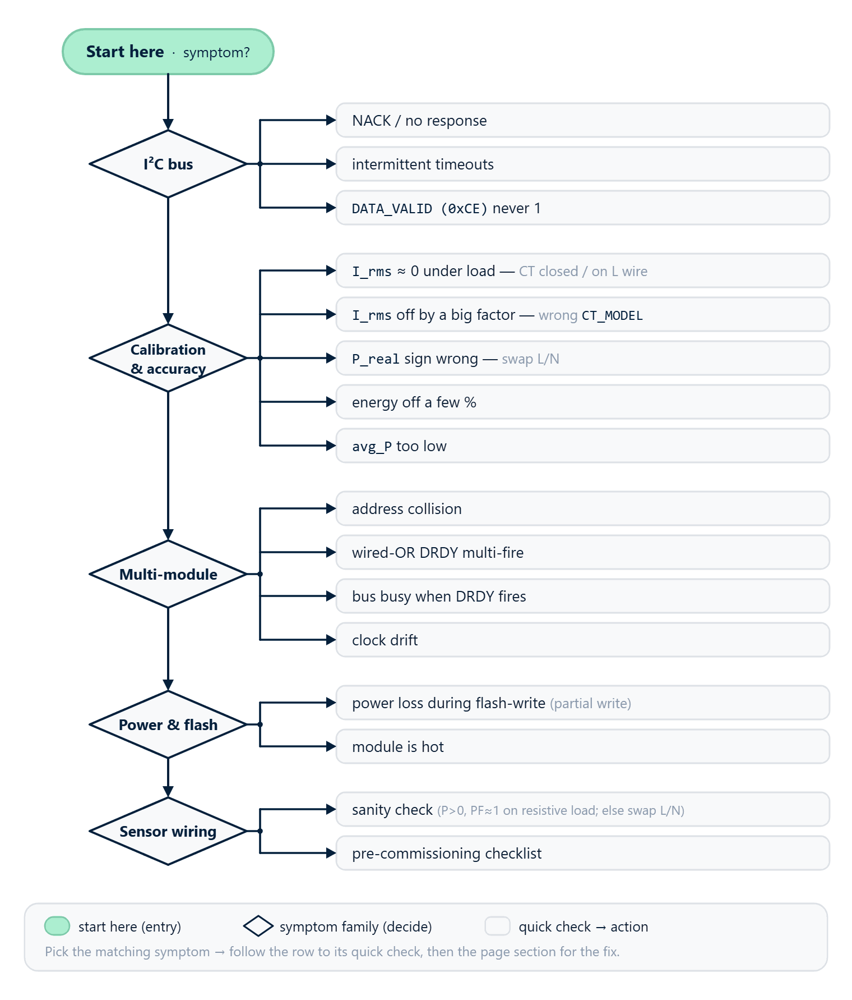

# 10 · Troubleshooting



This chapter is organized by **the symptoms you observe**, not by
internal error classification. If you're here, something isn't
working as it should. Find your symptom in the list below, jump to
the matching section, and work through the diagnostic procedure.

Most bench problems fall into three categories:

1. **Bus-level** — the module doesn't respond over I²C, reads return
   `NaN` or `RB_ERR_NACK`.
2. **Data-level** — the module responds, but the numbers are wrong:
   zeros, strange values, wrong sign.
3. **Application-level** — the link is unstable, the Wh counter
   diverges, the sketch hangs.

Shortcut for the impatient: the `dev.retryExhaustionCount()` and
`dev.sanityRejectCount()` counters must be **0** in steady state. If
they aren't, jump straight to the "Module doesn't respond over I²C"
section below.

## Module doesn't respond over I²C

**What you observe:** `dev.begin()` returns `false` with
`lastError() == RB_ERR_NACK`, or runtime reads regularly "leak"
`RB_ERR_NACK` into user code.

### Step 1 — Bus scan

First, confirm that the module is even present on the bus:

```cpp
#include <Wire.h>

void setup() {
    Serial.begin(115200);
    Wire.begin();
    Serial.println(F("Scanning..."));
    for (uint8_t addr = 0x08; addr <= 0x77; addr++) {
        Wire.beginTransmission(addr);
        if (Wire.endTransmission() == 0) {
            Serial.print(F("Found 0x")); Serial.println(addr, HEX);
        }
    }
}
void loop() {}
```

Expected output: `Found 0x50` (or a different address if you changed it).

**If nothing is found** — the problem is in the wiring or power:

- SDA / SCL are not swapped.
- Both lines have a pull-up to 3.3 V (the module board has built-in
  4.7 kΩ pull-ups — no external ones are needed for a single module).
- The module's power pin actually carries 5 V (4.5–5.5 V) — older
  board revisions are not tolerant of 3.3 V.
- No other master (debug probe, another Arduino) is hanging on the
  same lines.

**If the module is found, but at an unexpected address** — someone
re-addressed it earlier on the bench. Update the constructor argument:

```cpp
RbAmp dev(Wire, 0x52);   // address from the bus scan
```

### Step 2 — ESP32 baseline NACK pattern

If the bus scan finds the module, but `dev.readVoltage()`
periodically returns `NaN` with `RB_ERR_NACK` — and you're on an
ESP32 — this is a **documented baseline pattern**: the ESP-IDF v5
`i2c_master` driver has quirks when working with rbAmp on v1.0
firmware.

The mitigation is already built into the library
(`RBAMP_NACK_RETRY_ATTEMPTS=3` by default on ESP32), but under heavy
load the retry budget can run out.

**What to do on ESP32:**

1. **Lower the bus speed to 50 kHz**:

   ```cpp
   Wire.begin();
   Wire.setClock(50000);
   ```

2. **Raise the number of retry attempts for a heavy workload**:

   ```cpp
   #define RBAMP_NACK_RETRY_ATTEMPTS 5
   #include <RbAmp.h>
   ```

3. **Monitor the retry-exhaustion counter** — it should stay zero in
   steady state:

   ```cpp
   if (dev.retryExhaustionCount() > 0) {
       Serial.print(F("WARN: retry exhausted: "));
       Serial.println(dev.retryExhaustionCount());
   }
   ```

### Step 3 — NACKs on non-ESP32 platforms

On AVR / STM32duino / ESP8266 / SAMD / RP2040 there is no baseline
NACK pattern — these platforms show a ~0 % NACK rate with rbAmp. The
library defaults to `RBAMP_NACK_RETRY_ATTEMPTS=1` on them.

If NACKs happen here, look for:

- **High bus capacitance** — long wires + many devices. Lower the
  speed to 100 kHz or shorten the cable.
- **Master contention** — the library does not support a multi-master
  configuration.
- **A floating SCL** between transactions — a missing pull-up.

## Current reads zero on a working load

**What you observe:** `dev.readCurrent(0)` returns `0.000` (or a very
small value), even though a real consumer is switched on (a kettle, a
lamp, an iron). `dev.readPowerFactor(0)` may show a strange value
(`NaN` / `0` / `±1`) — that's a consequence; the cause is in the
current.

### Diagnostic procedure

1. **Check that the sensor class and the CT model are configured:**

   ```cpp
   if (!dev.setSensorClass(RbAmpSensorClass::Sct013)) {
       Serial.println(F("class set failed"));
   }
   if (!dev.setCTModel(3)) {   // or your model: see below
       Serial.println(F("model set failed"));
   }
   ```

   Without these two calls the calibration coefficients aren't loaded,
   and the current always reads as zero. This step is done **once** at
   first installation — the choice is saved to the module's flash.

2. **Check that the CT model matches the load.** A large CT clamp (for
   example, SCT-013-100, 100 A) on a small load (a 50 W lamp = ~0.2 A)
   produces a signal right at the noise floor and the readings will be
   zero. Choose the **smallest** CT model that covers your maximum
   expected current. The full table is in
   [03 · Current sensor selection](03_sensor_selection.md).

   If you have a multi-channel module (UI2 / UI3) and you want to see
   both small loads and peak surges, consider the **dual-CT pattern**:
   a small clamp (for example, SCT-013-005) on a dedicated channel for
   the low range + a large one (SCT-013-030/100) on another channel
   for the high range; the master selects the value by a threshold.
   The pattern is discussed in
   [03 · Current sensor selection](03_sensor_selection.md), section
   "Dual-CT topology".

3. **Check the clamp orientation.** The arrow on the clamp body must
   point **in the direction of current toward the load**. If the clamp
   is "backwards", `readCurrent()` will give the correct magnitude, but
   `readPower()` will give a negative value on a consuming load. The
   confirmation — `readPowerFactor()` will show exactly −1.0 on a
   resistive load (instead of +1.0). The fix: either physically
   reinstall the clamp (unclip it, turn the arrow the right way,
   clip it back), or invert the sign on the master side.

### If all three steps pass and the current is still zero

Then the signal at the ADC really is below the noise floor. Check:

- **Whether current is actually flowing** — measure it with a
  multimeter (DC clamp / AC clamp meter) on the same wire.
- **Whether the clamp is intact** — there should be an AC voltage at
  the clamp connector proportional to the current (a few millivolts
  for consumer loads).
- **Whether you're clamping the right wire** — the line, not the
  neutral (although a clamp on the neutral will work too — it measures
  current amplitude, not direction).

## Readings jump around or come back as NaN

**What you observe:** `dev.readVoltage()` or `dev.readCurrent()`
periodically return `NaN`. `dev.lastError()` shows either
`RB_ERR_NACK` or `RB_ERR_NON_PHYSICAL`.

### If `lastError()` shows `RB_ERR_NACK`

See the "Module doesn't respond over I²C" section above — it's the
same class of problem, with one difference: the link is **partially**
working, but the retry budget occasionally runs out.

Steps:

1. On ESP32 — lower the speed to 50 kHz + raise
   `RBAMP_NACK_RETRY_ATTEMPTS=5`.
2. On other platforms — check the bus capacitance and the pull-ups.
3. Monitor `dev.retryExhaustionCount()` to watch the trend.

### If `lastError()` shows `RB_ERR_NON_PHYSICAL`

The library's **sanity filter** tripped: a float came off the bus
that is either `NaN`, or `Inf`, or `|x| > 10000` — obviously not a
physical value. The library discards such a value and reports
`RB_ERR_NON_PHYSICAL` instead of leaking garbage data into the
application.

This is a rare artifact. The steady-state value of
`dev.sanityRejectCount()` is **0**. If it isn't zero:

1. Check `dev.retryExhaustionCount()`. If both counters are nonzero,
   the link is unstable and the sanity filter is catching garbage
   after failed retries. Raise the retry budget (see above).
2. If `retryExhaustionCount == 0` but `sanityRejectCount > 0`, an
   artifact got through the retry layer. This happens under very heavy
   bus load. Raise `RBAMP_NACK_RETRY_ATTEMPTS=5` and repeat the test.

```cpp
Serial.print(F("retries exhausted: "));
Serial.print(dev.retryExhaustionCount());
Serial.print(F("  sanity rejects: "));
Serial.println(dev.sanityRejectCount());
```

## Power Factor looks strange

**What you observe:** `dev.readPowerFactor(0)` returns a value that
doesn't match the load type.

Expectations by load:

| Load | Expected PF |
|---|---|
| Kettle, iron, incandescent lamp | +0.95 .. +1.0 (resistive) |
| Refrigerator, compressor motor | +0.6 .. +0.85 (inductive) |
| LED lamp, TV (switching PSU) | +0.5 .. +0.95 (nonlinear) |
| PV inverter exporting power | negative PF |

### PF = NaN or 0 when I = 0

PF is defined as `P / (U × I)`. At zero current `I=0` the math is
undefined. The specific value returned depends on the firmware (it may
be `NaN`, `0`, or a placeholder) — this is normal as long as the
current is genuinely zero. Once there's current, there will be a valid
PF.

### PF is exactly −1.0 on a purely consuming load

The clamp is installed "backwards" — the arrow does not point in the
direction of current toward the load. The fix: either reinstall the
clamp correctly, or handle the sign on the master side
(`p = -p; pf = -pf;` if you know the load can't be a PV inverter).

### PF floats between +0.3 and +0.7 on a resistive load

- **Possible cause:** the CT clamp is hanging on a wire of a
  **different phase** than the one the module's U input is connected
  to. In a distribution panel with several phases it's easy to clamp
  onto the wrong phase by mistake — a 120° or 180° phase shift between
  U and I gives exactly these PF values. The fix is to install the
  module so that the U input and the CT hang on the same phase.
- **Alternative:** the load really isn't purely resistive. Repeat the
  test with a known resistive load (an electric kettle at full power).

## Period snapshots are always `stale`

**What you observe:** `dev.readPeriodSnapshot(snap)` returns `false`
with `lastError() == RB_ERR_STALE`. This means the module didn't
finish integrating the previous period by the time of the next read.

The library protects against double-counting Wh: on a stale read it
records a master timestamp, and the next successful snapshot covers
one period, not two.

**Acceptable:** rare stales (1–2 per hour at a 60 s cadence).
**Not acceptable:** consecutive stales — that means the firmware is
unresponsive or the master is polling too often.

### Cadence check procedure

1. **Check the cadence:** 60 s between latches is comfortable; 30 s is
   marginal; < 10 s guarantees stales.
2. **Check the module's responsiveness** between snapshots:

   ```cpp
   if (dev.probe()) {
       Serial.println(F("alive"));
   }
   ```

3. **Direct flag check** — `dev.isPeriodValid()` does a single-byte
   read with no side effects.
4. **Check the firmware version** — `dev.firmwareVersion()` should
   report `0x04` (v1.3, current production); older firmware (`0x01`
   v1.0 / `0x02` v1.1 / `0x03` v1.2) shows more stales.

## Wh accounting diverges from a reference

**What you observe:** `dev.energy().wh(0)` diverges, after several
hours / days of operation, from the reading of the utility meter or a
reference meter (Kill-A-Watt and the like).

### First rule out the trivial

1. **Current sensor calibration:** make sure `setSensorClass()` and
   `setCTModel()` were called with the correct CT model (see
   [03 · Current sensor selection](03_sensor_selection.md)). Without
   this, the RMS current is computed with the default floor and the
   power value will be systematically biased.
2. **Dropped stale snapshots:** if `dev.energy().wh()` is consistently
   lower than the reference, this could be missed intervals — a
   snapshot came back stale, the library protected against
   double-counting, but the interval measurement was lost. Check the
   cadence (see above).
3. **Master clock drift:** `millis()` by itself is reliable. But if
   the master enters deep-sleep without preserving the RTC, the
   interval between the previous and the next latch is lost. Enable the
   RTC for such scenarios.

### Accumulator accuracy by platform

| Platform | Accumulator type | Long-term accuracy |
|---|---|---|
| ESP32 / ESP8266 / STM32duino / SAMD / RP2040 | 64-bit `double` | drift < 1 LSB / year @ 60 s cadence |
| Arduino AVR (Uno, Mega, Nano) | 32-bit `float` (toolchain) | ~0.01 % drift per day |

For AVR on long soak installations, periodically reset the accumulator
and save the long-term total to your own persistent store:

```cpp
// Once a day in the MQTT-publish hook
mqtt.publish("rbamp/wh_daily", String(dev.energy().wh(0)));
dev.energy().reset(0);
```

### `snap.latch_ms` reads ~27% short of the real period — this is EXPECTED, not a bug

**What you observe:** if, for your own diagnostics, you divide
`snap.latch_ms` (the chip-side software timer) by the real wall-clock
time between two `readPeriodSnapshot()` calls, the ratio comes out at
**~0.73** (that is, the chip-side timer undercounts by ~27%).

**This is by design and HW-validated** (bench measurements across all
4 sister-libs: esp-idf 0.7396, arduino 0.729, python 0.743 — all
converge in the 26-27% window). The cause is SysTick starvation on the
slave: under load, DMA/ISR leave too little cycle budget for regular
incrementing of the software timer. `latch_ms` (register `0xEC`) is
intended **only as a diagnostic indicator** of slave activity, **NOT
for billing**.

> **Canon**: `dev.energy().wh(ch)` integrates over the **master
> `millis()`** (the master's wall-clock), not over `snap.latch_ms`.
> The Arduino library's Wh accounting is **accurate** — bench measure:
> relative error vs independent ground-truth = **0.0000%** (lib
> integration math `avg_p × master_dt / 3600000` exact). All 4
> sister-libs (arduino, esp-idf, python, esphome) use the same canon.

If your code relies on `snap.latch_ms` for some sub-period
computations, switch to your own `millis()`. If you just see the
discrepancy in the logs and are worried — it's normal; remove the
discrepancy from your diagnostics or accept the 27% gap as expected.

### `RB_ERR_STALE` on every read — the master automatically holds the anchor

**What you observe:** `dev.readPeriodSnapshot(snap)` periodically
returns `false` with `lastError() == RB_ERR_STALE`. (See also the
"Period snapshots are always stale" section above.)

**Canonical dt-handling**: on a stale read the Arduino library does
NOT zero its internal `_last_latch_ms` anchor. The next valid read
gets a `master_dt` equal to the **full** interval since the previous
successful snapshot — that is, it covers both the "lost" stale period
and the current one. The firmware preserves the `avg_p` accumulator
across an empty latch (firmware-side persistence): on the next valid
latch this is already the value averaged over the whole interval. The
Wh integration **stays accurate** — no double-count, no under-count.

No special stale handling is needed in the master's code: the library
does everything correctly, automatically. Just ignore `RB_ERR_STALE`
if it's rare; if it's frequent, diagnose the cadence (section above).

## ESP32 sketch hangs after a few minutes

**What you observe:** the sketch on ESP32 starts up fine, then goes
into a hang / restart loop / WDT timeout after 1–30 minutes.

### `Wire` hangs on a marginal bus — three-layer mitigation

**What you observe specifically:** a sketch on ESP32 (Arduino-ESP32
core) polls rbAmp fine for several minutes, then "dead" hangs in the
middle of a `dev.readAll(...)` / `dev.readVoltage()` /
`fleet.pollAll()` call. If task-WDT is enabled, it catches the hang;
otherwise the sketch just stops responding. The decoded backtrace ends
at the function `i2c_ll_is_bus_busy` (the IDF i2c_master driver, file
`i2c_master.c:526`, pre-send bus-busy wait).

**What's happening:** the Arduino-ESP32 `Wire` wraps the same IDF
i2c_master driver as native ESP-IDF projects. On a marginal bus (weak
pull-ups, long traces, EMI, ZC interference), `SDA`/`SCL` can briefly
"stick" in an undefined state. Before each transaction the IDF
i2c_master spins in the `i2c_ll_is_bus_busy` loop, waiting for the bus
to free up — this spin is **NOT bounded** by the library's I²C
timeout. If bus-busy holds longer than the spin lasts without
servicing other tasks, the FreeRTOS IDLE task doesn't get the CPU, and
the whole sketch hangs.

**This is not a "debugger-only artifact".** Validated on the bench
(the same hardware harness and load):

| Bus configuration | Hang rate |
|---|---|
| 2 weak module pull-ups + debugger NRST attached | ~1 hang / 2.1 min |
| 1 weak module pull-up, no debugger | ~1 hang / 3.3 min (≈ 12 hangs per hour) |
| + external **4.7 kΩ pull-up** on the DUT SDA/SCL | **0 hangs** (12-min soak, 1300 cycles, 0 reboots, 0 WDT triggers) |

The correlation is clear — the bus-integrity fix removes the hang
entirely. The library logic is not implicated: `RbAmpFleet::pollAll()`,
MISS-individual modules, and the retry/sanity counters stayed clean on
every run right up to the hang itself.

**Three-layer mitigation (apply all three layers):**

1. **External pull-up (~4.7 kΩ) on SDA and SCL** to 3.3 V at a single
   point on the bus. The ESP32-internal pull-ups (~45 kΩ) and the ones
   built into the modules (~10 kΩ with N modules in parallel) are weak
   for a multi-module bus of real length. Cut the built-in ones on all
   modules but one (or on all of them — then you rely solely on the
   external ones). See [04 · Wiring](04_hardware.md) section
   "Multi-module bus — the primary topology".
2. **Don't run a production build with the debugger NRST attached.** In
   a debug session the reset line can hold SDA/SCL in an undefined
   state on detach/attach, triggering a bus-wedge on the next
   transaction. On a field build (no debugger) this factor goes away.
3. **App-level task-WDT on the poll task** — defense-in-depth. If for
   some reason the pull-ups stayed marginal, or some other cause of a
   wedge arose, the WDT will reboot the sketch. Bench 12-min soak: the
   WDT caught and recovered all 12 hangs in the configuration without
   an external pull-up. **Proper bus pull-ups — field fix; app-WDT —
   recovery posture.**

```cpp
#include "esp_task_wdt.h"

void setup() {
    // Layer 3 setup — defense-in-depth.
    esp_task_wdt_config_t wdt_cfg = {
        .timeout_ms = 8000,            // 8 s with a large margin
        .idle_core_mask = 0,
        .trigger_panic = true,         // on timeout — panic+reboot
    };
    esp_task_wdt_reconfigure(&wdt_cfg);
    esp_task_wdt_add(NULL);            // this task (loop) under WDT

    // ... rest of the initialization ...
}

void loop() {
    fleet.pollAll(snaps, status, RBAMP_FLEET_MAX_MODULES, n_ok);
    // ... processing ...
    esp_task_wdt_reset();              // "I'm alive" — every cycle
    delay(200);
}
```

**What NOT to do**: don't try to work around the problem with a larger
`Wire.setTimeout()` parameter — it doesn't bound the bus-busy
pre-spin, which is a different code path in the IDF driver. The fix is
bus integrity (layer 1) + a supervisor (layer 3).

### Watchdog timeout in `wifi_connect()`

**Cause:** the unbounded loop `while (WiFi.status() != WL_CONNECTED) delay(500)`
triggers the task-WDT after ~5 s (default).

**Fix:** a bounded wait with a restart fallback:

```cpp
uint32_t t0 = millis();
while (WiFi.status() != WL_CONNECTED) {
    delay(500);
    if (millis() - t0 > 30000) { ESP.restart(); }
}
```

### The MQTT broker disconnects every ~15 s

**Cause:** `PubSubClient` defaults to keepalive = 15 s, while
`mqtt.loop()` is called only in the "slow" path (once every 60 s
together with `readPeriodSnapshot()`).

**Fix:** set the keepalive to 60 s **and** call `mqtt.loop()` on every
pass of `loop()`:

```cpp
mqtt.setKeepAlive(60);

void loop() {
    if (!mqtt.connected()) mqtt.connect("rbamp-id");
    mqtt.loop();    // every iteration, not once every 60 s
    // ...rest of the logic, slowed down via millis()...
}
```

### TLS handshake fail (cloud integrations)

**Cause:** the ESP32 heap is insufficient for the TLS handshake
(~30 kB required). It often combines with WiFi + MQTT + buffers —
leaving < 20 kB.

**Fix:**

- Trim `setBufferSize()` for the MQTT client to the minimum.
- Use `WiFi.mode(WIFI_STA)` (not `WIFI_AP_STA`).
- Disable BLE: `btStop()` in `setup()`.

If `ESP.getFreeHeap()` shows < 25 kB before `client.connect()`, the
TLS handshake will most likely fail.

## `setSensorClass()` / `setCTModel()` returns `RB_ERR_PARAM`

**What you observe:** one of the configuration calls returns `false`,
`lastError() == RB_ERR_PARAM`.

Possible causes:

1. **`setCTModel()` called before `setSensorClass()`**. Sensor class
   first, then model — see
   [03 · Current sensor selection](03_sensor_selection.md) and
   [09 · API reference § Sensor configuration](09_api_reference.md).
2. **Invalid model code** — for the `Sct013` class the valid set is
   `{1, 2, 3, 4, 6}` (non-contiguous; code 5 is reserved in v1.3
   firmware, the former SCT-013-100). For other classes, see the
   per-class accept-set table in
   [03 · Current sensor selection](03_sensor_selection.md#per-class-ct-validation).
   Codes that don't match the class return `RB_ERR_PARAM` (lib-side
   pre-bus guard) or `DEV_ERR_PARAM` (firmware-side, if YAML slips past).
3. **Invalid channel index** in the per-channel form
   `setCTModel(channel, code)` — it must be < `dev.channels()`.

## Error handling: `REG_ERROR` last-write + `EVENT_FLAGS.bit3` durable (v1.3)

**v1.3 canon (HW-confirmed)**: `REG_ERROR (0x02)` is
**last-write-outcome**, and **NOT sticky**. On each register write the
firmware sets `reg_error = ERR_OK`; a subsequent unrelated write
**clears** the previous error.

**Durable error signal** = `EVENT_FLAGS (0x2A) bit3` — sticky (W1C),
asserted immediately on any rejected write/command.

**Pattern 1 — one-off post-operation capture** (if the outcome of this
specific operation matters):

```cpp
bool ok = dev.saveUserConfig();
uint8_t dev_err = dev.readReg(0x02);   // IMMEDIATELY, before the next write
```

**Pattern 2 — durable error monitoring** (canonical):

```cpp
uint8_t event_flags = dev.readReg(0x2A);
if (event_flags & (1 << 3)) {
    uint8_t last_err = dev.readReg(0x02);
    // handle
    dev.writeReg(0x2A, (1 << 3));        // W1C clear bit3
    // or dev.clearError();
}
```

> ⚠ **REVERSAL** of the previous "sticky" documentation (v1.3 A3 root
> canon). REG_ERROR is last-write-outcome, not sticky. Durability is
> provided by EVENT bit3.

> ⚠ **bit3 is an async channel, not for synchronous write validation**:
> on a rejected write, bit3 is set **with a delay** relative to the
> moment the I²C transaction returns. Don't poll bit3 immediately after
> a write to check that write's outcome — for the outcome of **your
> own write** use **Pattern 1** (one-off `lastError()` capture right
> after the operation) or the setter's return code. `bit3` is for
> long-running monitoring of async facts (runtime, command-path), not
> for validating an operation you just performed.

### `lastError()` vs `readLastError()` — two different channels, not synonyms

Two functions with similar names, but **completely different
semantics**:

| | `lastError()` | `readLastError(out)` |
|---|---|---|
| **What it returns** | Library-cached `RB_ERR_*` code from the previous lib call | A single wire-read of the device's `REG_ERROR (0x02)` register |
| **An I²C operation?** | **No** — just a memory read | **Yes** — a single read transaction |
| **Semantics** | Lib-side validation outcome (client guard, retry-state, etc.) | Device-side last-write outcome (`DEV_ERR_*` mnemonic) |
| **When updated** | After every lib method | After every bus-accepted write on the device |
| **Example value** | `RB_ERR_PARAM` after a client-side guard | `0xFE (DEV_ERR_PARAM)` after a rejected write on the device |
| **Example of mismatch** | `lastError() == RB_ERR_PARAM` (the setter blocked it pre-bus) | `readLastError() → 0x00` (nothing reached the device) |

**When to use each**:
- **`lastError()`** — for application logic, parsing lib-side outcomes
  (retry, fallback, error classification), with no I²C overhead.
- **`readLastError()`** — when you want the extended device-side cause
  code (for example, `DEV_ERR_PARAM (0xFE)` vs `DEV_ERR_NOT_READY` vs
  `DEV_ERR_FLASH_PARAMS_BAD (0xFB)`) on Channel B (DUT-side rejection).
  See the §"v1.3 error model — two independent channels" in
  [09 · API reference](09_api_reference.md).

The distinction is especially important when debugging Channel A
(client-side guard): the setter returns `false` +
`lastError() == RB_ERR_PARAM`, but `readLastError() == 0x00` — because
the lib blocked it before the wire operation, and `REG_ERROR` on the
device was not touched.

**Caveat:** `DEV_ERR_CLONE (0xF9)` is NOT cleared via
`CMD_CLEAR_ERROR` — it's an anti-clone sentinel (only a reboot or a
factory reset).

## A fresh-flash module shows `0xFB` on the first boot (NORMAL)

**What you observe:** a freshly flashed module on its first boot shows
`REG_ERROR = 0xFB` (`DEV_ERR_FLASH_PARAMS_BAD`) + EVENT bit3.

**Cause:** the params page is uninitialized → factory defaults loaded.
This is **NORMAL** for a virgin module, not fatal.

**Fix:** configure sensor_class + ct_model + (optionally) address,
then `dev.saveUserConfig()`. After a successful SAVE →
`REG_ERROR = 0x00`, bit3 clear.

## `commitAddressChange()` returns `RB_ERR_TIMEOUT`

**What you observe:** `prepareAddressChange()` went through, but
`commitAddressChange()` returns `false`,
`lastError() == RB_ERR_TIMEOUT`.

**Cause:** the armed-state window (5 s after `prepareAddressChange`)
expired. WiFi/MQTT/any blocking I/O between `prepare` and `commit` is
the main source of the window expiring. `dev.probe()` won't help here
(the module responds; the problem is in the state machine).

**What to do:** call `prepareAddressChange()` again and immediately,
**in the same loop() iteration**, with no network calls in between,
call `commitAddressChange()`.

> ✅ **`REG_I2C_ADDRESS (0x30)` now reads the ACTIVE address at boot**
> (v1.3 Fix 4 addr-boot-sync). After a post-commit reboot, reading 0x30
> will show the new active address. For the most reliable verification
> of a two-phase address commit, try a read at the new address (it
> should ACK on the bus). After a host-write (staging), the register
> echoes the staged candidate until `CMD_COMMIT_ADDR` + reset — this is
> by-design behaviour.

For more on the two-phase address commit, see
[09 · API reference](09_api_reference.md) and
[04 · Wiring](04_hardware.md).

## Reads fail while switching relay loads (EMI transients)

**What you observe:** `dev.readVoltage()` / `dev.readCurrent()`
periodically return `NAN`, `lastError() == RB_ERR_NACK` or
`RB_ERR_IO` — but **only during active switching** of a
relay/inductive load on the same setup. Steady-state reads are
reliable.

**Cause (C.12 HW-confirmed root 2026-06-15):** during relay switching
(a 5 A load) EMI fails ~67% of I²C transactions (~8/12 in the hw
measurement). The bus self-recovers, **no wedge occurs**, no module is
lost — but the current read fails.

**Fix — application-level retry**:

```cpp
float robust_read_voltage(RbAmp& dev) {
    for (int attempt = 0; attempt < 5; attempt++) {
        float v = dev.readVoltage();
        if (!isnan(v)) return v;
        delay(20);   // a short pause before the retry
    }
    return NAN;
}
```

> ⚠ **Library-side bus recovery is not sufficient on its own**: when
> an EMI glitch overlaps the driver's retry window, an explicit
> application-level retry with a pause is needed.

Alternative: if the master sees the relay-switching events, delay
reads by ~50-100 ms after the commutation.

## Error code summary table

`dev.lastError()` returns one of these codes after every public API
call. `RbAmp::errorString(code)` returns a human-readable string.

| Code | String | When | Where to look |
|---|---|---|---|
| `RB_OK` (0) | "OK" | success | — |
| `RB_ERR_IO` (-1) | "I2C transport failure" | the bus driver returned non-OK | wiring, power, pull-ups |
| `RB_ERR_NACK` (-2) | "NACK — device absent or busy" | retry exhausted | "Module doesn't respond over I²C" section |
| `RB_ERR_TIMEOUT` (-3) | "Bus timeout" | the `waitReady` / `commitAddressChange` window expired | "commitAddressChange() returns RB_ERR_TIMEOUT" section |
| `RB_ERR_NOT_READY` (-4) | "Device not ready" | (reserved) | — |
| `RB_ERR_STALE` (-5) | "Period snapshot stale" | the period-ready flag = 0 | "Period snapshots are always stale" section |
| `RB_ERR_PARAM` (-6) | "Bad parameter" | invalid channel index / invalid model code / invalid address range | "setSensorClass() / setCTModel() returns RB_ERR_PARAM" section |
| `RB_ERR_MODE` (-7) | "Operation requires factory mode" | a factory-only operation (for example `saveGains()` in production) | do not call factory-only operations on production firmware — these are blocked by design |
| `RB_ERR_CHECKSUM` (-8) | "Codegen parity mismatch" | (reserved for codegen CI) | — |
| `RB_ERR_VERSION` (-9) | "Unsupported firmware version" | `REG_VERSION` = 0 / 0xFF | check the module connection |
| `RB_ERR_NOT_IMPLEMENTED` (-10) | "Not implemented" | (reserved) | — |
| `RB_ERR_NON_PHYSICAL` (-11) | "Non-physical value (NaN/Inf/out-of-bounds)" | the sanity filter rejected a float | "Readings jump around or come back as NaN" section |

## Diagnostic counter summary table

In a healthy soak run (12 h, the SoakMonitor sketch) all stay
**zero**:

| Counter | Steady-state | Reset |
|---|---|---|
| `dev.retryExhaustionCount()` | 0 | `dev.resetCounters()` |
| `dev.sanityRejectCount()` | 0 | `dev.resetCounters()` |
| `dev.lastError()` after a read | `RB_OK` (0) | automatically on the next call |
| stale fraction in period snapshots | < 1 % | (cumulative — no reset) |

If any of these are nonzero in steady state, go back to the
corresponding section above.

## Bus-level debug with a logic analyzer

For deep debugging, when the library can no longer tell you what's
happening on the wire, capture SDA + SCL with a logic analyzer
(Saleae, DSLogic Plus, a Sigrok-compatible one):

- Sample rate ≥ 1 MS/s at 100 kHz I²C; ≥ 4 MS/s at 400 kHz.
- The I²C decoder in Sigrok / Saleae will show ACK / NACK on each byte
  + the address phase.
- Compare your sketch's calls (`dev.readVoltage()` etc.) against the
  expected byte sequence — they should match exactly. Burst-reads
  (several bytes in one transaction via address auto-increment) are
  supported. **Writes** are NOT auto-increment — each byte is a
  separate transaction.

If the library's behaviour diverges from the capture, open an issue
with the capture file attached (`.sal` / `.dsl` / `.csv`).

## When to contact support

If you've worked through the relevant section above and the problem
persists, open an issue:

[github.com/rb-amp/rbamp-arduino/issues](https://github.com/rb-amp/rbamp-arduino/issues)

In the issue, include:

- **Host MCU + Arduino core version** (for example, ESP32-S3 on
  Arduino-ESP32 3.0.4).
- **Library version** (`RbAmp` from the Library Manager).
- **Module firmware version** — `dev.firmwareVersion()`.
- **Minimal sketch** that reproduces the problem (~30 LOC).
- **`dev.lastError()` + `dev.errorString(dev.lastError())` +
  `dev.retryExhaustionCount()` + `dev.sanityRejectCount()`** at the
  moment of failure.
- **(If available)** a logic-analyzer capture file from the moment of
  failure.

## Links

- [05 · Quickstart](05_quickstart.md) — your first working sketch
- [09 · API reference](09_api_reference.md) — the full API +
  warnings on the public-with-WARNING methods
- [03 · Current sensor selection](03_sensor_selection.md) — the
  SCT-013 model table, dual-CT topology for a wide dynamic range,
  approaches to improving sensitivity at low currents